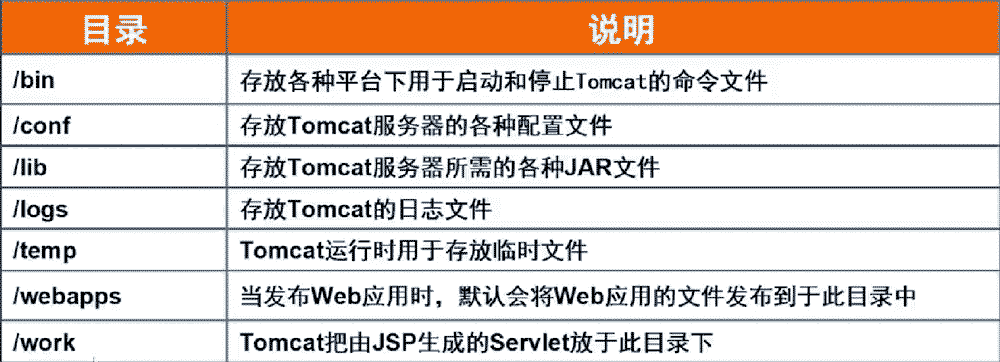

# Java Web 应用程序

### Web应用程序

Web应用程序开发，是目前软件开发领域三大方向之一。

* 桌面应用程序：QQ、Office等

* Web应用程序：京东、天猫等

* 嵌入式应用程序：安卓、iPhone

JavaEE方向需求一直较大，也就是就业比较容易和稳定。

### 静态网页与动态网页

**静态网页**

表现形式：网页中的内容是固定的，不能自动更新

所需技术：HTML、CSS

**动态网页**

网页中内容通过程序动态显示，自动更新。

所需技术：HTML、CSS，数据库技术、至少一门高级语言（Java、C#、PHP、Python、GoLang、Node.js、C++等）、JavaScript、XML等。主流的动态网页脚本技术Jsp、Asp.net、Php等

### 开发环境

* JDK7.0+

* Tomcat7.0+

Tomcat服务器目录结构：



* MyEclipse or eclipse

手动编写第一个Web程序，步骤：

```
1.在Tomcat WebApps中创建项目目录
2.编写index.jsp
3.创建WEB-INF目录
4.测试运行
```

> [!TIP|style:flat|label:WEB-INF目录结构：]

> WEB-INF是Java web应用的**安全目录**。所谓安全就是客户端无法访问，只有服务端可以访问的目录。

> web.xml，项目部署文件

> classes文件夹，用于存放*.class文件。

> lib文件夹，用于存放需要的jar包。

```
# /tomcat9/webapps/examples/WEB-INF
/classes 编译生成的字节码文件
/jsp 
/jsp2
/lib 项目需要用的一些java包
/tags
web.xml
```

> [!TIP|style:flat|label:MyEclipse与Eclipse]

> MyEclipse 收费，继承了很多收费的插件，比如SSH、安卓等

> Eclipse 免费开源，不包含任何附加功能的插件

MyEclipse 配置JRE

Eclipse
