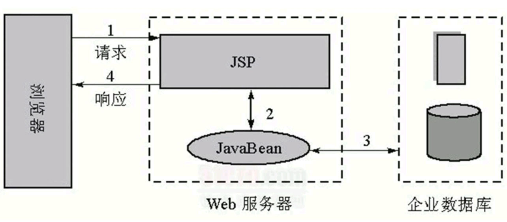

# JavaBean

是一种JAVA语言写成的可重用组件。为写成JavaBean，类必须是具体的和公共的，并且具有无参数的构造器。

JavaBean 通过提供符合一致性设计模式的公共方法将内部域暴露成员属性，set和get方法获取。众所周知，属性名称符合这种模式，其他Java 类可以通过自省机制(反射机制)发现和操作这些JavaBean 的属性。

> [!TIP|style:flat|label:JavaBeans]

> 就是**符合某种特定的规范的java类**。使用JavaBeans的好处是实现代码复用，减少冗余，功能区分明确，提高代码的可维护性。

### JavaBean设计原则


```java
// JavaBean设计原则实例：设计学生类
// 1.公有类
public class Students {
    // 2.属性私有
    private String name;
    private int age;
    // 3.无参的公共构造方法
    public Students() {
        // constructor
    }
    // 4.setter和getter方法
    public void setName(String name) { this.name = name; }
    public String getName() { return this.name; }
    public void setAge(int age) { this.age = age; }
    public int getAge() { return this.age; }
}
```

### Jsp动作元素

JSP动作元素(action elements)为请求处理阶段提供信息。动作元素即**标签**，遵循XML语法。有一个包含元素名的开始标签，可以有属性、可选的内容、与开始标签匹配的结束标签。

**第一类与存取JavaBean有关的，包括：**

```
<jsp:useBean>
<jsp:setProperty>
<jsp:getProperty>
```

**第二类是JSP1.2就开始有的基本元素，包括6个动作元素**

```
<jsp:include>
<jsp:forward>
<jsp:param>
<jsp:params>
<jsp:plugin>
<jsp:fallback>
```

**第三类是JSP2.0新增的元素，主要与JSP Document有关，包括6个元素**

```
<jsp:root>
<jsp:declaration>
<jsp:scriptlet>
<jsp:expression>
<jsp:text>
<jsp:output>
```

**第四类是JSP2.0新增，主要是用来动态生成XML元素标签的值，包括3个动作**

```
<jsp:attribute>
<jsp:body>
<jsp:element>
```

**第五类是JSP2.0新增，主要是用在Tag File中，有2个元素**

```
<jsp:invoke>
<jsp:dobody>
```

### 在JSP页面中使用JavaBean

1.**像使用普通java一样，创建javabean实例。**

src/com.test/Users.java

```java
package com.test;

public class Users {
	// private properties
	private String username;
	private String password;
	// constructor
	public Users() {
	}
	public String getUsername() {
		return username;
	}
	public void setUsername(String username) {
		this.username = username;
	}
	public String getPassword() {
		return password;
	}
	public void setPassword(String password) {
		this.password = password;
	}	
}
```

bean-users.jsp

```jsp
<%@ page language="java" import="java.util.*" contentType="text/html; charset=utf-8"%>
<%@ page import="com.test.Users"%>
<!DOCTYPE HTML>
<html>
  <head>    
    <title>使用普通方式创建javabean实例</title>
  </head>
  <body>
    <%
	    Users u = new Users();
	    u.setUsername("admin");
	    u.setPassword("123465");
    %>
    <p>用户名：<%=u.getUsername() %></p>
    <p>密码：<%=u.getPassword() %></p>
  </body>
</html>
```

2.**在JSP页面中通常使用JSP动作标签使用JavaBean。**

useBeans/setProperty/getProperty

> [!TIP|style:flat|label:useBeans]

> `<jsp:useBeans>`

> 作用：在jsp页面中实例化或者在指定范围内使用JavaBean

```jsp
<jsp:useBean id="标识符" class="java类名" scope="作用范围" />
```

```jsp
<%@ page language="java" import="java.util.*" contentType="text/html; charset=utf-8"%>
<!DOCTYPE HTML>
<html>
  <head>    
    <title>2.在JSP页面中通常使用JSP动作标签使用JavaBean</title>
  </head>
  <body>
    <jsp:useBean id="myUsers" class="com.test.Users" scope="page"></jsp:useBean>
    <p>用户名：<%=u.getUsername() %></p>
    <p>密码：<%=u.getPassword() %></p>
  </body>
</html>
```

> [!TIP|style:flat|label:setProperty]

> `<jsp:setProperty>`

> 作用：给已实例化的JavaBean对象的属性赋值，一共有4种形式。

1.跟表单关联

```jsp
<jsp:setProperty name="JavaBean实例名" property="*" />
```

2.跟表单关联

```jsp
<jsp:setProperty name="JavaBean实例名" property="JavaBean属性名" />
```

3.手动设置

```jsp
<jsp:setProperty name="JavaBean实例名" property="JavaBean属性名" value="BeanValue" />
```

4.跟request参数关联

```jsp
<jsp:setProperty name="JavaBean实例名" property="propertyName" param="request对象中的参数名" />
```

### 实例1

login.jsp

```jsp
<form action="do-login.jsp" method="post">
    <p>用户名: <input type="text" name="username"></p>
    <p>密 &nbsp;&nbsp;码: <input type="password" name="password"></p>
    <p><input type="submit" value="登 录"></p>
</form>
```

1.跟表单关联

do-login.jsp

```jsp
<body>
    <jsp:useBean id="testUsers" class="com.test.Users" scope="page"/>
    <jsp:setProperty name="testUsers" property="*"/>
    <p>用户名：<%=testUsers.getUsername() %></p>
    <p>密码：<%=testUsers.getPassword() %></p>
</body>
```

2.跟表单关联

do-login.jsp

```jsp
<body>
    <jsp:useBean id="testUsers" class="com.test.Users" scope="page"/>
    <jsp:setProperty name="testUsers" property="username"/>
    <p>用户名：<%=testUsers.getUsername() %></p>
    <p>密码：<%=testUsers.getPassword() %></p>
</body>
```

3.手动设置

do-login.jsp

```jsp
<body>
    <jsp:useBean id="testUsers" class="com.test.Users" scope="page"/>
    <jsp:setProperty name="testUsers" property="username" value="Jock"/>
    <jsp:setProperty name="testUsers" property="password" value="1234679"/>
    <p>用户名：<%=testUsers.getUsername() %></p>
    <p>密码：<%=testUsers.getPassword() %></p>
</body>
```

4.跟request参数关联

do-login.jsp?queryUserName=Tom&queryPassWord=999999

```jsp
<body>
    <jsp:useBean id="testUsers" class="com.test.Users" scope="page"/>
    <jsp:setProperty name="testUsers" property="username" param="queryUserName"/>
    <jsp:setProperty name="testUsers" property="password" param="queryPassWord"/>
    <!-- 使用传统的方式获取用户名、密码 -->
    <p>用户名：<%=testUsers.getUsername() %></p>
    <p>密码：<%=testUsers.getPassword() %></p>
</body>
```

> [!TIP|style:flat|label:getProperty]

> `<jsp:getProperty>`

> 作用：获取指定JavaBean对象的属性值。

```jsp
<jsp:getProperty name="JavaBean实例名" property="属性名" />
```

跟request参数关联

do-login.jsp?queryUserName=Tom&queryPassWord=999999

```jsp
<body>
    <jsp:useBean id="testUsers" class="com.test.Users" scope="page"/>
    <jsp:setProperty name="testUsers" property="username" param="queryUserName"/>
    <jsp:setProperty name="testUsers" property="password" param="queryPassWord"/>
    <!-- 使用getProperty方式获取用户名、密码 -->
    <p>用户名：<jsp:getProperty name="testUsers" property="username"/></p>
    <p>密码：<jsp:getProperty name="testUsers" property="password"/></p>
</body>
```

### JavaBean的4个作用域

使用useBean的scope属性，可以用来指定JavaBean的作用域。

|作用域|说明|
|:--|:--|
|**page**|仅在当前页面有效|
|**request**|可以通过HttpRequest.getAttribute() 方法取得JavaBean对象。|
|**session**|可以通过HttpSession.getAttribute() 方法获取JavaB对象。|
|**application**|可以通过application.getAttribute() 方法取得JavaBean对象|

```jsp
<jsp:useBean id="testUsers" class="com.test.Users" scope="application"/>
<!-- application -->
<%=((Users) application.getAttribute("testUsers")).getUsername() %>
<%=((Users) application.getAttribute("testUsers")).getPassword() %>
```

```jsp
<jsp:useBean id="testUsers" class="com.test.Users" scope="session"/>
<!-- session -->
<%=((Users) session.getAttribute("testUsers")).getUsername() %>
<%=((Users) session.getAttribute("testUsers")).getPassword() %>
```

```jsp
<jsp:useBean id="testUsers" class="com.test.Users" scope="request"/>
<!-- request -->
<%=((Users) request.getAttribute("testUsers")).getUsername() %>
<%=((Users) request.getAttribute("testUsers")).getPassword() %>
```

```jsp
<jsp:useBean id="testUsers" class="com.test.Users" scope="page"/>
<!-- page -->
<%
String username = "";
String password = "";
// 避免空指针异常
if (pageContext.getAttribute("testUsers") != null) {
    ((Users) username = pageContext.getAttribute("testUsers")).getUsername();
    ((Users) password = pageContext.getAttribute("testUsers")).getPassword();
}
%>

<%=username %>
<%=password %>
```

### Model 1

Java开发总的方向可以分为**Model 1**和**Model 2**。

**Model 1** 模型出现前，整个Web应用的情况：几乎全部由JSP页面组成，JSP页面接收处理客户端请求，对请求处理后直接作出相应。

**弊端**：在界面层充斥着大量的业务逻辑代码和数据访问层的代码，Web程序的可扩展性和可维护性非常差。

**JavaBean**的出现，可以使jsp页面中使用JavaBean封装的数据或者调用JavaBean的业务逻辑代码，这样大大提升了程序的可维护性。



### 总结

JavaBean就是符合某种设计规范的Java类

在Model 1中，由Jsp页面去调用JavaBean。

JavaBean既可以封装数据，同时也可以封装业务逻辑。

JavaBean一般把属性设计为私有，使用setter和getter访问属性。

### 实例

使用jsp + JavaBean完成用户登录功能

src/com.dao/UsersDao.java

```java
package com.dao;

import com.test.Users;

public class UsersDao {
	private String userName = "admin"; 
	private String passWord = "admin"; 
	
	// 用户登录验证
	public boolean checkLoginUserInfo(Users user) {
		return userName.equals(user.getUsername()) && passWord.equals(user.getPassword());
	}
}
```

bean-login.jsp

```jsp
<%@ page language="java" import="java.util.*" contentType="text/html; charset=utf-8"%>
<!DOCTYPE>
<html>
  <head>    
    <title>Login</title>
  </head>
  
  <body>
    <form action="bean-do-login.jsp" method="post">
    	<p>用户名: <input type="text" name="username"></p>
    	<p>密 &nbsp;&nbsp;码: <input type="password" name="password"></p>
    	<p><input type="submit" value="登 录"></p>
    </form>
  </body>
</html>
```

bean-do-login.jsp

```jsp
<%@ page language="java" import="java.util.*" contentType="text/html; charset=utf-8"%>
<jsp:useBean id="loginUser" class="com.test.Users" scope="page"/>
<jsp:useBean id="userDao" class="com.dao.UsersDao" scope="page"/>
<jsp:setProperty property="*" name="loginUser"/>

<%
	if (userDao.checkLoginUserInfo(loginUser)) {
		session.setAttribute("username", loginUser.getUsername());
		request.getRequestDispatcher("bean-login-success.jsp").forward(request, response);
	} else {
		response.sendRedirect("bean-login-failure.jsp");
	}
%>
```

bean-login-success.jsp

```jsp
<%@ page language="java" import="java.util.*" contentType="text/html; charset=utf-8"%>
<!DOCTYPE>
<html>
  <head>    
    <title>Login Success</title>
  </head>
  
  <body>
    <h1>登录成功</h1>
    <p>用户名：<%=session.getAttribute("username") %></p>
  </body>
</html>
```

bean-login-failure.jsp

```jsp
<%@ page language="java" import="java.util.*" contentType="text/html; charset=utf-8"%>
<!DOCTYPE>
<html>
  <head>    
    <title>Login Failure</title>
  </head>
  
  <body>
    <h1>登录失败</h1>
    <p>--</p>
  </body>
</html>
```