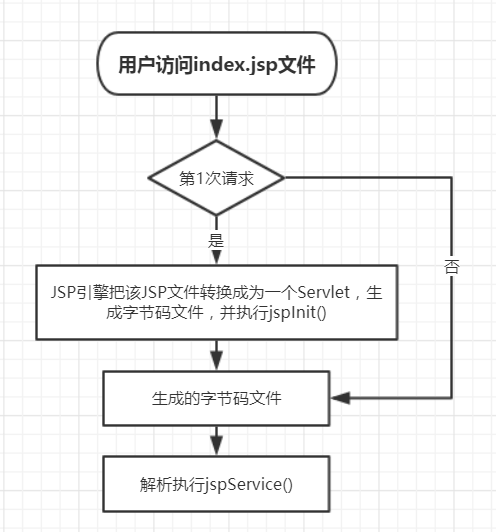

# Jsp基本语法

> [!TIP|style:flat|label:JSP（Java Server Pages]

> 其根本是一个简化的Servlet设计，他实现了在Java当中使用HTML标签。

> JSP是一种动态网页技术标准，也是JavaEE的标准。

> JSP与Servlet一样，是在服务器端执行的。

|名称|说明|
|:--|:--|
|Jsp|Java平台，安全性高，适合开发大型、企业级的Web应用程序。|
|Asp.net|.Net平台，简单易学。但是安全性以及跨平台性差。|
|PHP|简单、高效，成本低开发周期短，特别适合中小型企业的Web应用开发。|

### JSP页面元素构成


### JSP指令

|指令|说明|
|:--|:--|
|page指令|通常位于JSP页面的顶端，同一个页面可以多个page指令。|
|include指令|将一个外部文件嵌入到当前JSP文件中，同时解析这个页面中的JSP语句。|
|taglib指令|使用标签库定义新的自定义标签，在JSP页面中启用定制行为。|

### page指令语法

```jsp
<%@ page 属性="value" 属性2="valueA,valueB" ... 属性n="valueN"%>
```

|常用属性|描述|默认值|
|:--|:--|:--|
|language|指定JSP页面使用的脚本语言|java|
|import|通过该属性来引用脚本语言中使用到的类文件|无|
|contentType|原来指定JSP页面所采用的编码方式看，文件类型等|text/html,ISO-8856-1|

```jsp
<!--例子-->
<%@ page language="java" import="java.util.*" contentType="text/html; charset=utf-8"%>
```
### JSP注释

html的注释：

```jsp
<!-- html注释，浏览器客户端可见 -->
```

JSP的注释：

```jsp
<%-- jsp注释，浏览器客户端不可见--%>
```
JSP脚本注释：

```jsp
<%
  // 单行注释
  /*
  多行注释
  */
%>
```

### JSP脚本

在JSP页面中**执行的java代码**。

语法：

```jsp
<%
  // Java代码
  // do someThing
  out.println("通过jsp脚本输出的内容：这是JavaEE开发。");
%>
```

### JSP声明

在JSP页面中定义**变量**或**方法**。

语法：

```jsp
<%!
  // java代码
  // 变量
  String str = "测试文本内容";
  // 方法
  int add(int x, int y) {
    return x + y;
  }
%>
```

### JSP表达式

在JSP页面中**执行的表达式**。

语法：

```jsp
<%=表达式 %>
```

注意：**表达式不以分号结束**。

```jsp
测试str变量输出：<%=str %><br>
add方法输出：10 + 20 = <%=add(10, 20)%>
```

### JSP生命周期



**jspService()方法**被调用来处理客户端的请求。对每一个请求，JSP引擎创建一个新的线程来处理该请求。

如果有多个客户端同时请求该JSP文件，则JSP引擎会**创建多个线程**，每个客户端请求对应一个线程。以多线程方式执行可以大大降低对系统的资源需求，提高系统的并发量及响应时间。但也要注意多线程的编程带来的同步问题，比如资源共享，线程安全等。由于该Servlet始终驻于内存，所以响应是非常快的。

```
# 生成的字节码文件目录
/tomcatx.x/work/Catalina/localhost/MyEclipseTest090301
```

> [!WARNING|style:flat|label:练习]

> 当用户第一次请求一个jsp页面时，首先被执行的方法是(A)

> A. **构造方法**

> B. jspInit()

> C. jspService()

> D. jspDestroy()

```
codes/first-eclipse-web-project/
```

### 练习

输出99乘法表：

```jsp
<%!
  // 表达式输出
  String printMultiTable() {
     String str = "";
     int max = 9;
     for (int i = 1; i <= max; i++) {
        for (int j = 1; j <= i; j++) {
            str += i + " * " + j + " = " + (i * j) + "&nbsp;&nbsp;&nbsp;&nbsp;";
        }
        str += "<br>";
     }
     return str;
  }
  
  // 脚本方式
  void printMT(JspWriter out) throws Exception {
    for (int i = 1; i <= 9; i++) {
        for (int j = 1; j <= i; j++) {
            out.print(i + " * " + j + " = " + (i * j) + "&nbsp;&nbsp;&nbsp;&nbsp;");
        }
        out.println("<br>");
    }
  }
%>
<h2>表达式方式：</h2>
<%=printMultiTable() %>
    <br>
<h2>脚本方式：</h2>
<% printMT(out); %>
```

