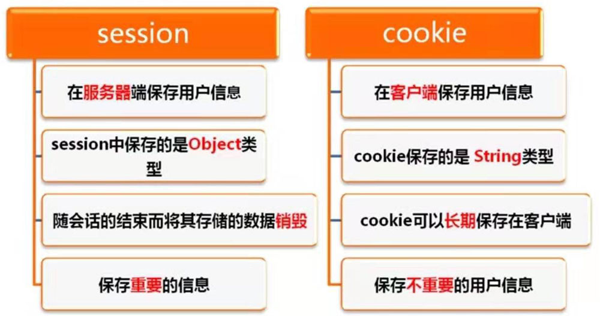

# Jsp状态管理

* http协议无状态性

* 保存用户状态的两大机制

* Cookie简介

* Cookie的创建与使用

* Session与Cookie的对比

### http协议无状态性

无状态是指，当浏览器发送请求给服务器，服务器响应浏览器请求；但当同一个浏览器再次发送请求给该服务器时，服务器并不知道它就是之前那个浏览器；简单讲就是服务器不会去记得你，所以就是无状态协议。


### 保存用户状态的两大机制

* Session

* Cookie


### Cookie简介

> [!TIP|style:flat|Cookie]

> Cookie（译：小甜饼），是Web服务器保存在客户端的一系列文本信息。

> 典型应用：判断注册用户是否已经登录网站；购物车的处理等。

**作用**：

对特定对象的追踪；保存用户网页浏览记录与习惯；简化登录...

**安全风险**：容易泄露用户信息

### Cookie的创建与使用

创建Cookie对象：

```
Cookie cookie = new Cookie(String key, Object value);
```

写入Cookie对象：

```
response.addCookie(cookie);
```

读取Cookie对象：

```
Cookie[] cookie = request.getCookies();
```

|常用方法|说明|
|:--|:--|
|void setMaxAge(int expiry)|设置cookie的有效期，以秒为单位|
|void setValue(String value)|在cookie创建后，对cookie进行赋值|
|String getName()|获取cookie的名称|
|String getValue()|获取cookie的值|
|int getMaxAge()|获取cookie的有效时间，单位秒|

实例：实现记忆用户名和密码功能

cookie-login.jsp

```jsp
<%@ page language="java" import="java.util.*,java.net.*" contentType="text/html; charset=utf-8"%>
<!DOCTYPE>
<html>
  <head>    
    <title>Cookie Login</title>
  </head>
  
  <body>
    <h1>登录</h1>
    <%
    request.setCharacterEncoding("utf-8");
    String username = "";
    String password = "";
    
    Cookie[] cookies = request.getCookies();
	if (cookies != null && cookies.length > 0) {
		for (Cookie c:cookies) {
			if (c.getName().equals("username")) {
				username = URLDecoder.decode(c.getValue(), "utf-8");
			}
			if (c.getName().equals("password")) {
				password = URLDecoder.decode(c.getValue(), "utf-8");
			}
		}
	}
    %>
    <form action="cookie-do-login.jsp" method="post">
	    <p>用户名：<input type="text" name="username" value="<%=username %>"></p>
	    <p>密 码：<input type="password" name="password" value="<%=password %>"></p>
	    <p>
	    	<label>
	    		<input type="checkbox" name="isUseCookie" checked value="1"> 十天内保存登录状态
	    	</label>
	    </p>
	    <p><input type="submit" value="登录"></p>
    </form>
  </body>
</html>
```

cookie-do-login.jsp

```jsp
<%@ page language="java" import="java.util.*,java.net.*" contentType="text/html; charset=utf-8"%>
<!DOCTYPE>
<html>
  <head>    
    <title>Cookie Logged</title>
  </head>
  
  <body>
    <h1>登录成功</h1>
    <%
		request.setCharacterEncoding("utf-8");  	
    	String[] isUseCookie = request.getParameterValues("isUseCookie");
    	if (isUseCookie != null && isUseCookie.length > 0) {
    		String username = URLEncoder.encode(request.getParameter("username"), "utf-8");
    		String password = URLEncoder.encode(request.getParameter("password"), "utf-8");
    		
    		// 保存用户信息
    		Cookie usernameCookie = new Cookie("username", username);
    		Cookie passwordCookie = new Cookie("password", password);
    		// 保存时间10天
    		usernameCookie.setMaxAge(864000);
    		passwordCookie.setMaxAge(864000);
    		response.addCookie(usernameCookie);
    		response.addCookie(passwordCookie);
    	} else {
    		Cookie[] cookies = request.getCookies();
    		if (cookies != null && cookies.length > 0) {
    			for (Cookie c:cookies) {
    				if (c.getName().equals("username") || c.getName().equals("password")) {
    					// 设置cookie失效
    					c.setMaxAge(0);
    					// 重新保存
    					response.addCookie(c);
    				}
    			}
    		}
    	}
    %>
    <a href="cookie-user-info.jsp">查看用户信息</a>
  </body>
</html>
```

cookie-user-info.jsp

```jsp
<%@ page language="java" import="java.util.*,java.net.*" contentType="text/html; charset=utf-8"%>
<!DOCTYPE>
<html>
  <head>    
    <title>Cookie Login</title>
  </head>
  
  <body>
    <h1>登录</h1>
    <%
    request.setCharacterEncoding("utf-8");
    String username = "";
    String password = "";
    
    Cookie[] cookies = request.getCookies();
	if (cookies != null && cookies.length > 0) {
		for (Cookie c:cookies) {
			if (c.getName().equals("username")) {
				username = URLDecoder.decode(c.getValue(), "utf-8");
			}
			if (c.getName().equals("password")) {
				password = URLDecoder.decode(c.getValue(), "utf-8");
			}
		}
	}
    %>
    <p>用户名：<%=username %></p>
    <p>密 码：<%=password %></p>
  </body>
</html>
```

### Session与Cookie的对比

