# Oracle

甲骨文公司，全称甲骨文股份有限公司(甲骨文软件系统有限公司)，是全球最大的企业级软件公司，总部位于美国加利福尼亚州的红木滩。1989年正式进入中国市场。2013年，甲骨文已超越 IBM ，成为继 Microsoft 后全球第二大软件公司。

### 安装与卸载

* 安装

https://www.oracle.com/downloads/

* 卸载

```
# windows系统运行
deinstall/deinstall.bat
```

### 用户与表空间

> [!TIP|style:flat|label:系统用户]

> sys, system。密码为安装软件时设置的密码

> sysman。密码为安装软件时设置的密码

> scott。密码默认为tiger

权限依次从高到低

* 使用system用户登录

```
# 打开SQL Plus工具
[username/password] [@server] [as sysdba|sysoper]
# system/pw @orcl as sysdba
# orcl 就是自己设置的服务名
```

不区分大小写

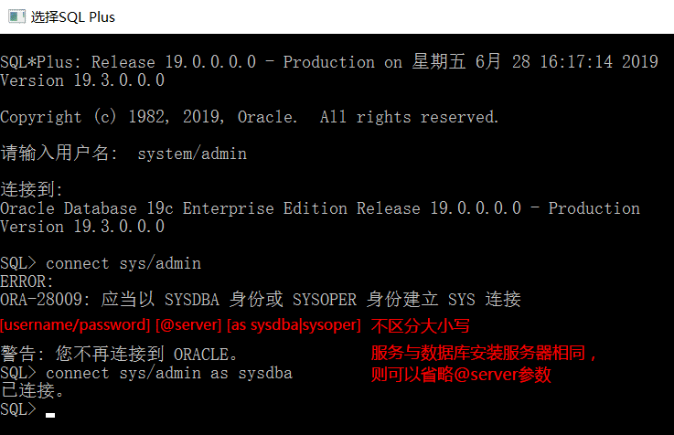

* 查看登录用户

```
show user
# 结果 USER 为 "SYS"
```

数据字典

```
desc dba_users
```


查看有哪些用户，注意SQL语句要以 `;` 分号结束。

```
select username from dba_users;
```

* 启用scott用户

默认情况下，该用户为锁定状态。

```
# 启用用户的语句
alter user uesename account unlock
# alter user username account lock
```

**ORA-01918: 用户 'SCOTT' 不存在**

# 表空间

> [!TIP|style:flat|label:表空间]

> **数据库与表空间**

> 表空间实际上是数据库的逻辑存储空间，可以理解为在数据库中开辟的一个空间，用来存储数据库对象。一个数据库可以由多个表空间构成。

> 此特点也是与MySQL等数据库的主要区别。Oracle的很多优化也是通过表空间来实现的。

> **表空间与数据文件**

> 表空间实际上是由多个数据文件构成的，数据文件的大小和位置可以由用户自己定义。

> 表空间可分为：永久表空间、临时表空间、UNDO表空间

* 永久表空间

数据库中需要永久化存储的一些对象。比如表、视图、存储过程等

* 临时表空间

数据库操作过程中，中间执行的过程，执行结束后，存放的内容将被自动释放掉。不进行永久性的保存。

* UNDO表空间

用于保存事务所修改的旧址，即保存修改之前的数据。可以利用此功能实现回滚等操作。

### 查看用户的表空间

```
# 系统用户登录查看的数据字典
dba_tablespaces
# 普通用户登录查看的数据字典
user_tablespaces
```

* 系统用户

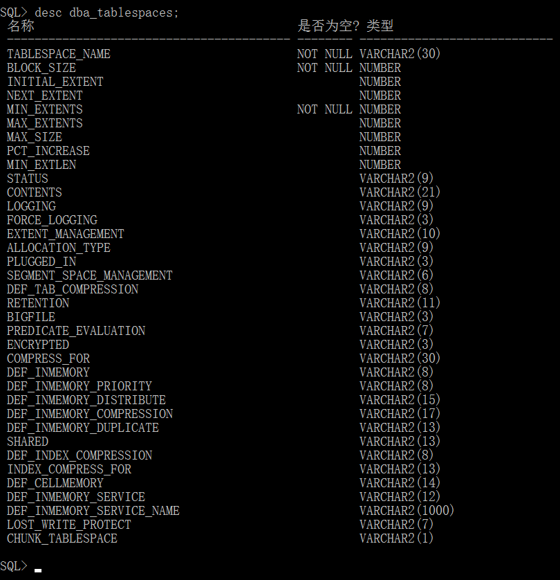

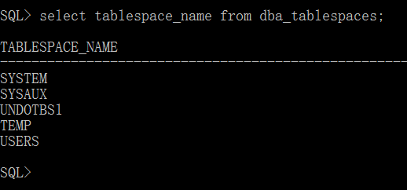

SYSTEM: 系统表空间

SYSAUX: 辅助表空间，安装Oracle示例使用的表空间。

UNDOTBS1: 社交类型表空间

TEMP: 

USERS: 

* 普通用户


```
# 系统用户登录查看的数据字典
dba_users
# 普通用户登录查看的数据字典
user_users
```


* 设置用户的默认或临时表空间

```
ALTER USER username DEFAULT|TEMPORARY TABLESPACE tablespace_name
# alter user system default tablespace xxx
```

> [!TIP|style:flat|label:单选]

> 在Oracle数据库安装完成后，system用户的默认表空间和临时表空间分别是：`system, temp`

### 创建表空间

```
CREATE [TEMPORARY] TABLESPACE
tablespace_name
TEMPFILE|DATAFILE `xx.dbf` SIZE xx
```

`xx.dbf`如未指定路径，将被直接存储在Oracle的安装默认目录中。

```
# 创建一个大小为10M的永久表空间
create tablespace test1_tablespace
datafile `test1file.dbf` size 10m;
```

```
# 创建一个大小为10M的临时表空间
create temporary tablespace temp_test_tablespace
tempfile `tempfile1.dbf` size 10m;
```

查看表空间路径等操作


### 修改表空间

> [!TIP|style:flat|label:修改表空间的状态]

> 脱机状态

> 读写状态


**设置联机或脱机状态**

```
# 修改表空间的在线状态
ALTER TABLESPACE tablespace_name
ONLINE|OFFLINE;
```

脱机状态的表空间无法使用。


查看online_status


```
# 修改表空间的读写状态
ALTER TABLESPACE tablespace_name
READ ONLY|READ WRITE
```


> [!TIP|style:flat|label:修改数据文件]

> 增加数据文件

> 删除数据文件

```
# 向tablespace_name中添加一个文件
ALTER TABLESPACE tablespace_name
ADD DATAFILE 'xx.dbf' SIZE xx;
```

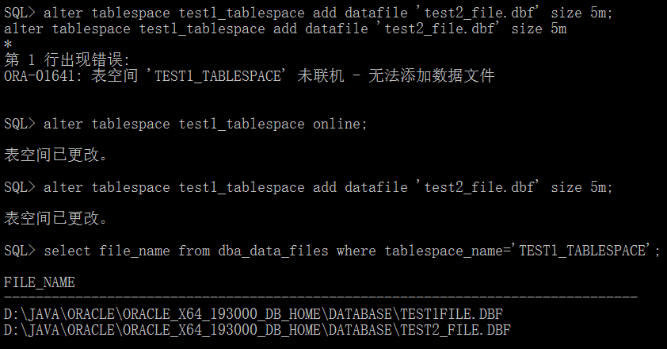


```
# 删除数据文件
ALTER TABLESPACE tablespace_name
DROP DATAFILE 'filename.dbf'
```

> [!WARNING|style:flate|label:注意]

> 不能删除表空间的第一个数据文件

> 如果需要删除第一个数据文件，则需将整个表空间删除。

### 删除表空间

```
DROP TABLESPACE
tablespace_name [INCLUDING CONTENTS]
# 只删除表空间，不删除数据文件 drop tablespace test1_tablespace
# 删除表空间和文件 drop tablespace test1_tablespace including contents
```

# 管理表

> [!TIP|style:flat|label:认识表]

> 表是存储数据的基本存储单位

> 表是二维结构，由行(记录)和列(域和字段)组成

### 约定

1、每一列数据必须具有相同数据类型。

2、列名是唯一的

3、每一行数据的唯一性

### 数据类型

字符型、数值型、日期型、其他类型

|字符型|n最大值|说明|
|:--|:--|:--|
|CHAR(n)|2000|n为10时，输入长度3字符的字符将补齐7个空格，易造成空间浪费|
|NCHAR(n)|1000|按Unicode格式存放数据，常用于存储汉字|
|VARCHAR2(n)|4000|存储可变长度数据类型，相对CHAR更节约空间|
|NVARCHAR2(n)|2000|支持Unicode格式存放|

|数值型|说明|
|:--|:--|
|NUMBER(p,s)|p有效数字；s小数点后位数，支持正负数|
|FLOAT(n)|用于存储二进制数据，能表示二进制位数1-126位。转换成10进制，则需乘以0.30103|

```
NUMBER(5, 2)
# 有效数字5位，保留2位小数，如123.45
```

|日期型|说明|
|:--|:--|
|DATE|范围：公元前4712年1月1日，至公元9999年12月31日，精确到秒|
|TIMESTAMP||

|其他类型|最大能存储|说明|
|:--|:--|:--|
|BLOB|4GB数据|以二进制格式存储|
|CLOB|4GB数据|以字符串形式存储|

### 管理表

创建表、修改表、删除表

```
# 创建表语法
CREATE TABLE table_name
(
    column_name datatype [default value], ...
)
# default 添加默认值，默认value获取系统当前时间sysdate
```


> [!TIP|style:flat|label:修改表]

> 添加字段、更改字段数据类型、修改字段名、删除字段、修改表名

```
# 添加字段
ALTER TABLE table_name
ADD column_name datatype [default value];
# alter table user_info add remark varchar2(500);
```

```
# 更改字段数据类型
ALTER TABLE table_name
MODIFY column_name datatype [default value];
# alter table user_info modify remark varchar2(300);
# alter table user_info modify password number(10, 0);
```

```
# 删除字段
ALTER TABLE table_name
DROP COLUMN column_name;
# alter table user_info drop column remark;
```

```
# 修改字段名称
ALTER TABLE table_name
RENAME COLUMN column_name TO new_column_name;
# alter table user_info rename column user_name to username;
```

```
# 修改表名
RENAME table_name TO new_table_name;
# rename user_info to userinfo;
```

> [!TIP|style:flat|label:删除表]

> 删除表中所有数据

> 删除表

```
# 删除表中所有数据
TRUNCATE TABLE table_name
```

```
# 删除表
DROP TABLE table_name
```

### 操作表中数据

添加数据：INSERT语句、操作实例、复制表数据

* INSERT语句

```
# INSERT语句
INSERT INTO table_name
(column1, column2, ...)
VALUES(value1, value2, ...)
# column1 ...栏可以省略，但value栏的顺序必须与数据库表字段顺序一致
```

实例

```
# 向表中所有字段添加值
insert into user_info values(1, 'jock', '123456', '1522@qq.com', sysdate);
# sysdate 获取系统当前时间
```

```
# 向表中指定字段添加值
insert into user_info (id, user_name, password) values(2, 'tom', '123456');
```

* 复制表数据

```
# 在创建时复制
CREATE TABLE table_new
AS
SELECT column1, ...|* FROM table_old
# column 指定需要复制的字段
# * 代表复制所有字段数据
# create table new_userinfo as select * from user_info;
# create table new_userinfo2 as select id, user_name from user_info;
```

```
# 在添加时复制
INSERT INTO table_new
[(column1, ...)]
SELECT column1, ...|* FROM table_old
# 插入表的字段顺序及数据类型，需要与table_old表一致。
# insert into new_userinfo select * from user_info;
# insert into new_userinfo (id, user_name) select id, user_name from user_info;
```

* 修改数据

```
# UPDATE语句
UPDATE table_name
SET column1=value1, ... 
[WHERE conditions]
```

```
# 无条件更新
update user_info set password='1111111';
```

```
# 有条件更新
update user_info set password='222222', email='8888@xx.com' where id='2';
```

* 删除数据

```
# DELETE语句
DELETE FROM table_name
[WHERE conditions]
# drop删除表数据，要比delete快。
```

```
# 无条件删除
delete from user_info_copy;
```

```
# 有条件删除
delete from user_info where id='1';
```

# 约束

> [!TIP|style:flat|label:约束的作用]

> 定义规则：哪些字段是必须的，哪些字段该输入什么类型的值

> 确保完整性：数据的精确性、可靠性。

非空约束、主键约束、外键约束、唯一约束、检查约束

### 非空约束

> [!TIP|style:flat|label:非空约束]

> 在创建表时，设置非空约束 `NOT NULL`

> 在修改表时，添加非空约束

> 在修改表时，去除非空约束

```
# 在创建表时，设置非空约束
CREATE TABLE table_name (
    column_nae datatype NOT NULL, ...
)
```

```
create table user_info2 (
    id number(10, 0),
    username varchar2(32) not null,
    password varchar2(64) not null
);
```

```
# 在修改表时，添加非空约束
ALTER TABLE table_name
MODIFY column_name datatype NOT NULL;
# 如果被修改的字段，在表中已有空值将会抛出异常
```

```
# 在修改表时，去除非空约束
ALTER TABLE table_name
MODIFY column_name datatype NULL;
# alter table user_info modify user_name varchar2(64) null;
```

### 主键约束

> [!TIP|style:flat|label:主键约束]

> 作用：确保表当中每一行数据的唯一性

> 一张表只能设置一个主键约束

> 主键约束可以由多个字段构成（联合主键或复合主键）

在创建表时设置主键约束、在修改表时添加主键约束、更改约束的名称、删除主键约束

```
# 在创建表时设置主键约束
CREATE TABLE table_name (
    column_name datatype PRIMARY KEY, ...
)
```

```
# 例子
create table user_info3 (
    id number(10, 0) primary key,
    username varchar2(32),
    password varchar2(64)
);
```

```
# 联合主键或复合主键
CONSTRAINT constraint_name
PRIMARY KEY(column_name1, ...)
```

```
create table user_info4 (
    id number(10, 0),
    username varchar2(64),
    password varchar(64),
    constraint pk_id_username primary key (id, username)
);
# pk_id_username 可任意，取合法名称都行
```

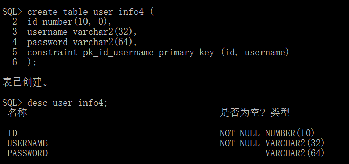

创建完成后，忘记了主键的名称，则可以通过 `user_constraints`

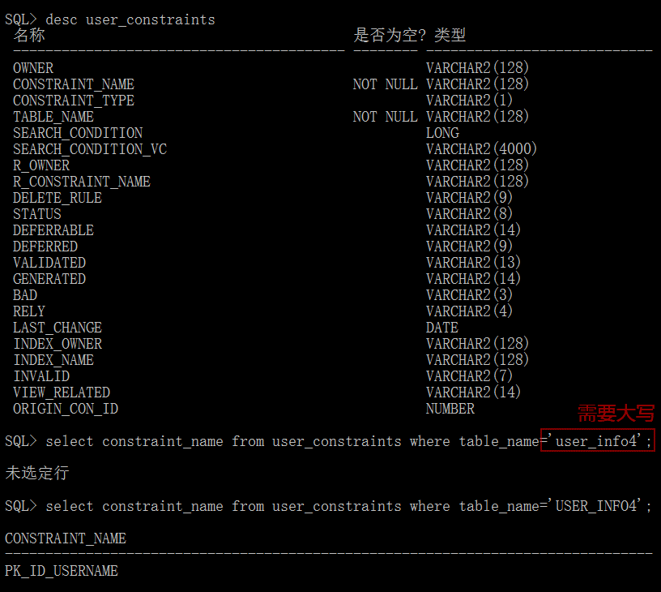

```
# 在修改表时添加主键约束
ALTER TABLE table_name
ADD CONSTRAINT constraint_name
PRIMARY KEY (column_name1, ...);
```

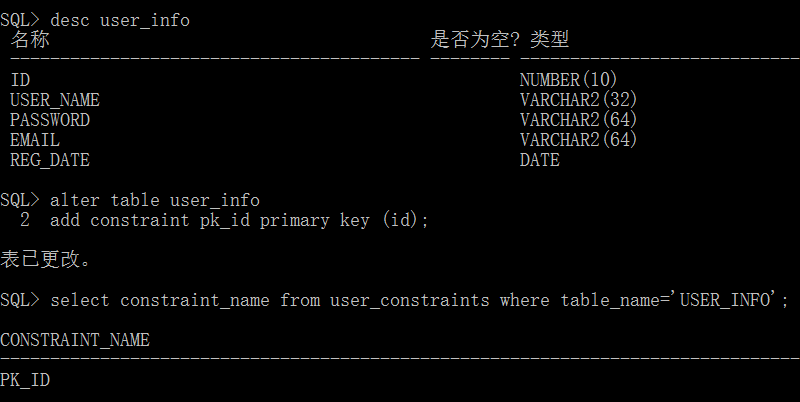

```
# 更改约束的名称constraint_name
ALTER TABLE table_name
RENAME CONSTRAINT old_name
TO new_name
```


> [!TIP|style:flat|label:删除主键约束]

> 禁用与启用

> 直接删除

```
# 暂时禁用，后期可能还会启用的情况
DISABLE|ENABLE CONSTRAINT constraint_name

# 禁用new_pk_id
# alter table user_info disable constraint new_pk_id;
# 查看禁用状态
# select constraint_name, status from user_constraints where table_name='USER_INFO';
```

```
# 直接删除1
DROP CONSTRAINT constraint_name

# alter table user_info drop constraint new_pk_id;
# 查看删除后的状态
# select constraint_name, status from user_constraints where table_name='USER_INFO';
# 结果：未选定行
```

```
# 直接删除2
DROP PRIMARY KEY [CASCADE]
# CASCADE 其他表引用该字段的地方，也一起删掉约束
# alter table user_info3 drop primary key;
```

### 外键约束

> [!TIP|style:flat|label:外键约束]

> 唯一一个涉及两个表当中字段关系约束。

> 又称**主从表关系**

在创建表时设置外键约束、在修改表时添加外键约束、删除外键约束

```
# 在创建表时设置外键约束1
CREATE TABLE table1
(
    column_name datatype REFERENCES
    table2 (column_name), ...
);
# table2 为主表
# table1 为从表
```

> [!WARNING|style:flat|label:注意]

> 设置外键约束时，主表的字段必须是主键。

> 主从表中相应字段必须是同一个数据类型。

> 从表中外键字段的值，必须来自主表中的相应字段的值，或者为null值。

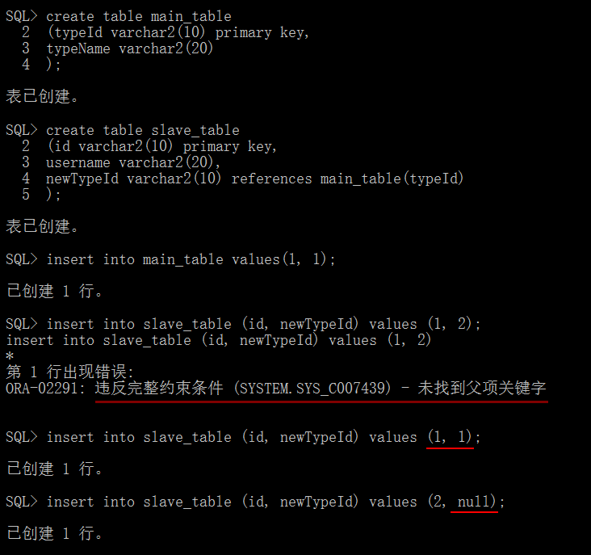

```
# 在创建表时设置外键约束2
CONSTRAINT constraint_name FOREIGN
KEY (column_name) REFERENCES
main_table_name (column_name) [ON DELETE CASCADE]
# constraint_name通常以fk开头(FOREIGN KEY首字母)，且不能重名。
# ON DELETE CASCADE级联删除，即主表中某条数据被删除，在从表中使用了该数据的行也将被删除。从而确保主从表的完整性。
```

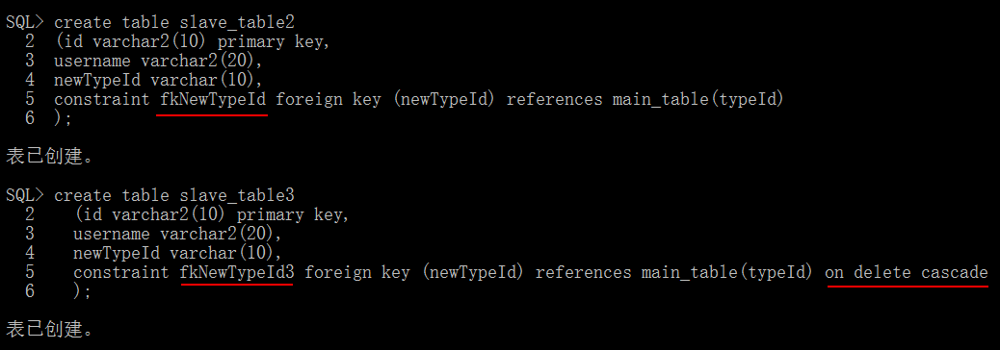

```
# 在修改表时添加外键约束
ADD CONSTRAINT constraint_name FOREIGN
KEY (column_name) REFERENCES
table_name (column_name) [ON DELETE CASCADE]
```


> [!TIP|style:flat|label:删除外键约束]

> 禁用与启用

> 直接删除

```
# 禁用与启用
DISABLE|ENABLE CONSTRAINT constraint_name
```

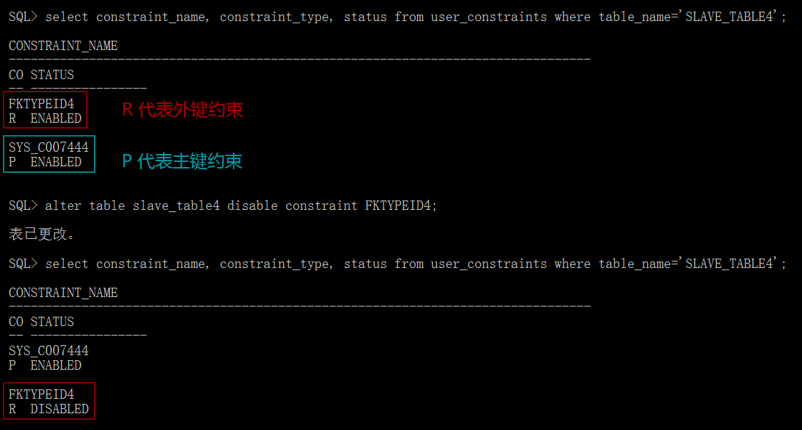

```
#直接删除
DROP CONSTRAINT constraint_name;
```


### 唯一约束

> [!TIP|style:flat|label:唯一约束 UNIQUE]

> 作用：保证字段值的唯一性。

> 与主键约束的区别：主键字段值必须是非空的；唯一约束允许有一个空值。主键在每张表中只有一个，唯一约束在每张表中可以由多个。

在创建表时设置唯一约束、在修改表时添加唯一约束、删除唯一约束

```
# 在创建表时设置唯一约束，分列级和表级
# 列级
CREATE TABLE table_name
(column_name datatype UNIQUE, ...)

# 表级
CONSTRAINT constraint_name
UNIQUE (column_name)
# constraint_name 约束名必须是唯一的。
```

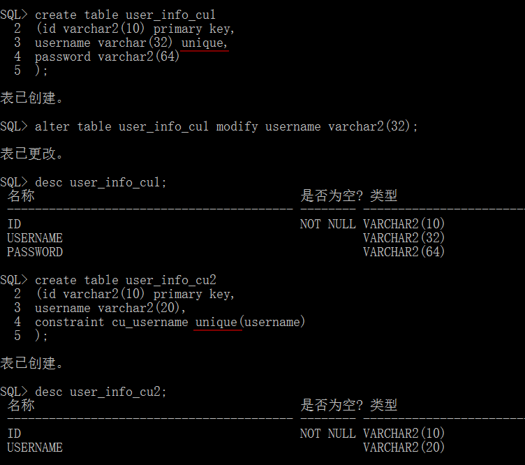

```
# 在修改表时添加唯一约束
ADD CONSTRAINT constraint_name
UNIQUE (column_name);
```

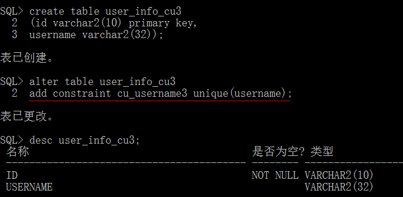

删除唯一约束

```
# 禁用/启用
ALTER TABLE table_name
DISABLE|ENABLE CONSTRAINT constraint_name

# 删除唯一约束
ALTER TABLE table_name
DROP CONSTRAINT constraint_name
```

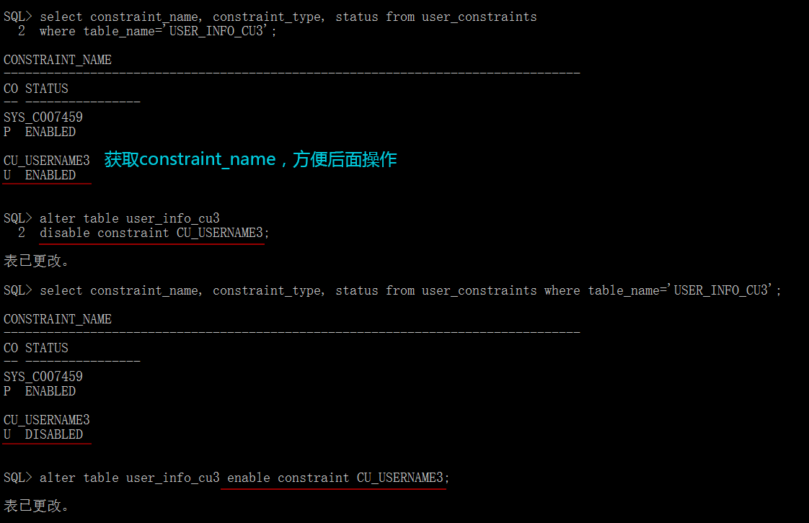

### 检查约束

作用：使表中的值更具有实际意义。

一张表中可以有多个检查约束。

```
例子，员工信息：
年龄：1000 工资：-50 电话号码：080-2222-3333
# 年龄、工资不符合（没有）实际意义。
```

在创建表时设置检查约束、在修改表时添加检查约束、删除检查约束

```
# 在创建表时设置检查约束：列级
CREATE TABLE table_name
(column_name datatype CHECK(expressions), ...)
```

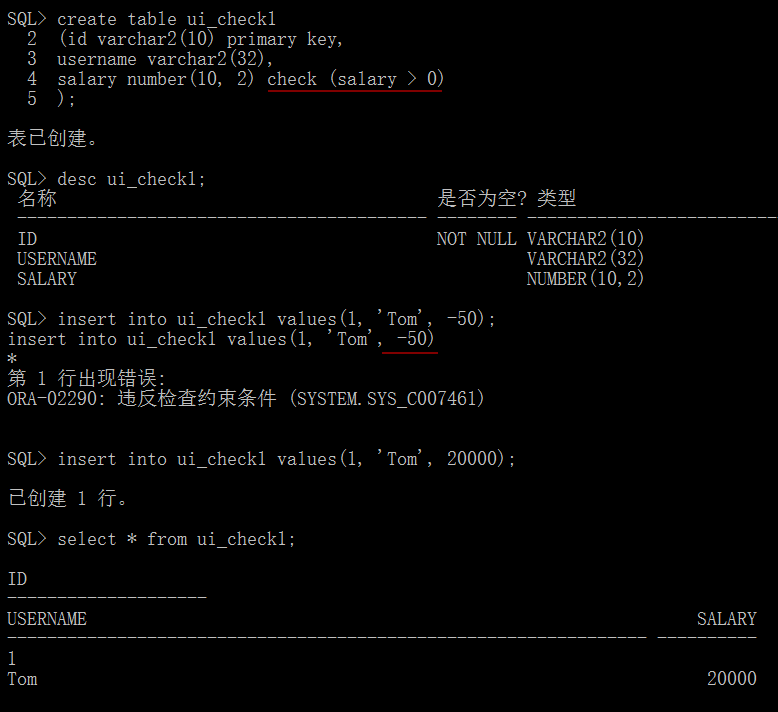

```
# 在创建表时设置检查约束：表级
CONSTRAINT constraint_name CHECK(expressions)
```

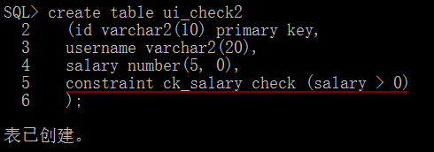

```
# 在修改表时添加检查约束
ALTER TABLE table_name
ADD CONSTRAINT constraint_name
CHECK (expressions);
```

```
# 禁用、启用
ALTER TABLE table_name
DISABLE|ENABLE CONSTRAINT constraint_name

# 删除检查约束
ALTER TABLE table_name
DROP CONSTRAINT constraint_name
```

### 总结

* 非空约束

* 主键约束：每张表只能有一个，可以由多个字段构成。

* 外键约束： 涉及两个表之间的关系

* 唯一约束

* 检查约束

> [!TIP|style:flat|label:具体操作]

> **在创建表时设置约束：**

> 非空约束只能在**列级**设置，不能再**表级**设置；

> 其他约束既可以在**列级**设置，也可以在**表级**设置；

> 并且设置非空约束是没有名字的。

> **在修改表时添加约束：**

> 与其他不同的还是 `非空约束`，使用的是修改字段方法 ALTER TABLE table_name MODIFY column_name datatype NOT NULL;

> **更改约束的名称：**

> 非空约束没有名称，所有不能改名；

> 其他约束可以修改约束名称；

> 通过数据字典 `user_constraints`查看约束名称、类型等信息；

> ALTER TABLE table_name RENAME CONSTRAINT old_name TO new_name;

> **删除约束：**

> 非空约束比较特殊，使用的是修改字段方法，即将NOT NULL改为可以为空NULL即可。ALTER TABLE table_name MODIFY column_name datatype NULL;

> 其他约束`启用enable或禁用disable`，DISABLE|ENABLE CONSTRAINT constraint_name；彻底删除 DROP CONSTRAINT constraint_name

> 删除主键约束: DROP PRIMARY KEY


------