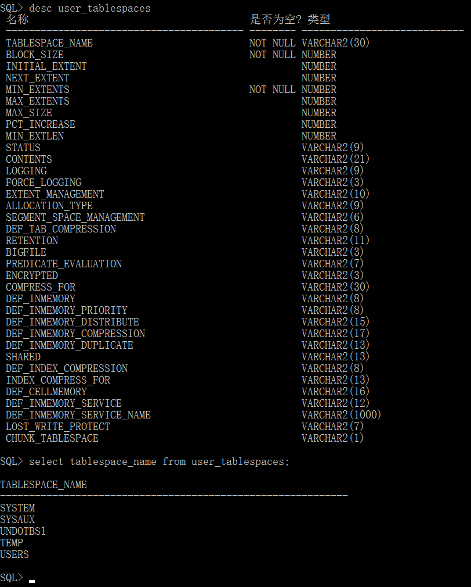
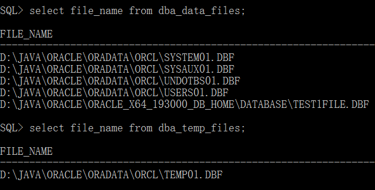
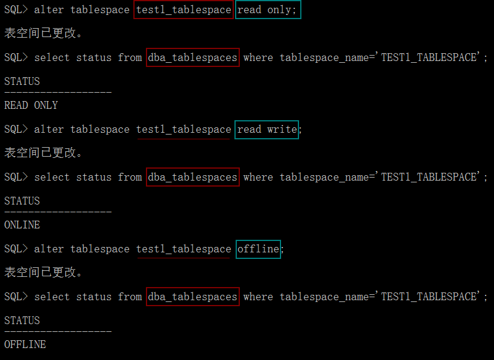

# 表空间

> [!TIP|style:flat|label:表空间]

> **数据库与表空间**

> **表空间**实际上是**数据库的逻辑存储空间**，可以理解为在数据库中开辟的一个空间，用来**存储数据库对象**。一个数据库可以由多个表空间构成。

> 此特点也是与MySQL等数据库的主要区别。Oracle的很多优化也是通过表空间来实现的。

> **表空间与数据文件**

> **表空间**实际上是由**多个数据文件**构成的，数据文件的大小和位置可以由用户自己定义。

> 表空间可分为：永久表空间、临时表空间、UNDO表空间

**永久表空间**

数据库中需要永久化存储的一些对象。比如表、视图、存储过程等

**临时表空间**

数据库操作过程中，中间执行的过程，执行结束后，存放的内容将被自动释放掉。不进行永久性的保存。

**UNDO表空间**

用于保存事务所修改的旧址，即保存修改之前的数据。可以利用此功能实现回滚等操作。

### 查看用户的表空间

```
# 系统用户登录查看的数据字典
dba_tablespaces
# 普通用户登录查看的数据字典
user_tablespaces
```

* 系统用户


SYSTEM: 系统表空间

SYSAUX: 辅助表空间，安装Oracle示例使用的表空间。

UNDOTBS1: 社交类型表空间

TEMP: 

USERS: 

* 普通用户



```
# 系统用户登录查看的数据字典
dba_users
# 普通用户登录查看的数据字典
user_users
```


* 设置用户的默认或临时表空间

```
ALTER USER username DEFAULT|TEMPORARY TABLESPACE tablespace_name
# alter user system default tablespace xxx
```

> [!TIP|style:flat|label:单选]

> 在Oracle数据库安装完成后，system用户的默认表空间和临时表空间分别是：`system, temp`

### 创建表空间

```
CREATE [TEMPORARY] TABLESPACE
tablespace_name
TEMPFILE|DATAFILE `xx.dbf` SIZE xx
```

`xx.dbf`如未指定路径，将被直接存储在Oracle的安装默认目录中。

```
# 创建一个大小为10M的永久表空间
create tablespace test1_tablespace
datafile `test1file.dbf` size 10m;
```

```
# 创建一个大小为10M的临时表空间
create temporary tablespace temp_test_tablespace
tempfile `tempfile1.dbf` size 10m;
```

查看表空间路径等操作




### 修改表空间

> [!TIP|style:flat|label:修改表空间的状态]

> 脱机状态

> 读写状态

**设置联机或脱机状态**

```
# 修改表空间的在线状态
ALTER TABLESPACE tablespace_name
ONLINE|OFFLINE;
```

脱机状态的表空间无法使用。


查看online_status


```
# 修改表空间的读写状态
ALTER TABLESPACE tablespace_name
READ ONLY|READ WRITE
```



> [!TIP|style:flat|label:修改数据文件]

> 增加数据文件

> 删除数据文件

```
# 向tablespace_name中添加一个文件
ALTER TABLESPACE tablespace_name
ADD DATAFILE 'xx.dbf' SIZE xx;
```


```
# 删除数据文件
ALTER TABLESPACE tablespace_name
DROP DATAFILE 'filename.dbf'
```

> [!WARNING|style:flate|label:注意]

> 不能删除表空间的第一个数据文件

> 如果需要删除第一个数据文件，则需将整个表空间删除。

### 删除表空间

```
DROP TABLESPACE
tablespace_name [INCLUDING CONTENTS]
# 只删除表空间，不删除数据文件 drop tablespace test1_tablespace
# 删除表空间和文件 drop tablespace test1_tablespace including contents
```