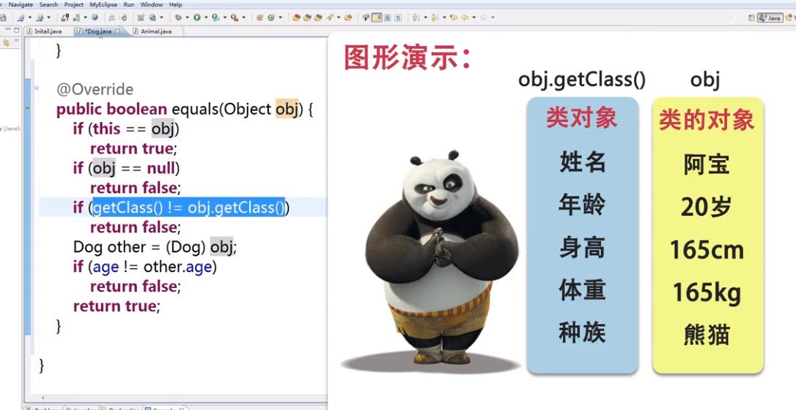

# 继承

继承是类与类的一种关系，是一种`is a`的关系。

> [!TIP|style:flat]

> Java中的继承是单继承。

### 优点：

1、子类拥有父类的所有属性和方法。`private修饰符`的属性和方法除外。

2、复用父类的代码（代码复用）。

### 语法：

```
class 子类 extends 父类
```

例子

```java
// Animal.java
class Animal {
  // 相当于JavaScript的constructor
  public Animal() {
    // ...
  }
  public name;
  public age;
  public void eat() {
    System.out.println("调用了Animal的eat方法");
  }
}
```

```java
// Dog.java
class Dog extends Animal {
}
```


```java
// Initial.java
class Initial {
  public static void main() {
    Dog dog = new Dog();
    dog.name = "DD";
    dog.age = 2;
    dog.eat();
  }
}
```

### 方法的重写

如果子类对继承父类的方法不满意，可以重写父类继承的方法，当调用方法时会优先调用子类的方法。

语法规则：

`返回值类型`，`方法名`，`参数类型及个数`都要与父类继承的方法相同，才叫`方法的重写`

### 继承的初始化顺序

初始化父类再初始化子类

先执行初始化对象中属性，再执行构造方法中的初始化

### final 关键字

使用final关键字做标识有`最终的`含义

1、final可以修饰类、方法、属性和变量

2、final修饰类，则该类不允许被继承

3、final修饰方法，则该方法不允许被覆盖（重写）

4、final修饰属性：则该类的属性不会进行隐式的初始化（类的初始化属性必须有值），或在构造方法中赋值（但只能选其一）。

5、final修饰变量，则该变量的值只能赋一次值，即变为常量。

```java
final public class Animal {
  // ...
}
```

### super 关键字

在对象的内部使用，可以代表父类对象。

访问父类的属性

```
super.age
```

访问父类的方法

```
super.eat()
```

例子

```java
// Dog.java
public void method() {
    System.out.println(super.age);
}
```

#### super的应用

1、子类的构造的过程当中必须调用其父类的构造方法。

2、如果子类的构造方法中没有显式调用父类的构造方法，则系统默认调用父类无参的构造方法。

3、如果显式的调用构造方法，必须在子类的构造方法的第一行。

```java
// Dog.java
public class Animal {
    // constructor
    public Animal() {
        super(); // 必须放在第一行
        // ...
    }
}
```

4、如果子类构造方法中既没有显式调用父类的构造方法，而父类又没有无参的构造方法，则编译就会出错。

### Object类

Object类是所有类的父类，如果一个类没有使用extends关键字明确标识继承另外一个类，那么这个类默认继承Object类。

Object类中的方法，适合所有子类。

#### 1、toString()方法

在Object类里面定义toString()方法的时候，返回的对象的哈希code码（对象地址字符串）

可以通过重写toString()方法表示出对象的属性

```
# Eclipse快速重写toString
菜单栏 -> source -> Generate toString
```

#### 2、equals()方法

比较的是对象的引用是否指向同一块内存地址。

一般情况下比较两个对象时，比较他的值是否一致，所以要进行重写。

```
# Eclipse快速生成
source -> Generate hasCode() and equals()...
```


