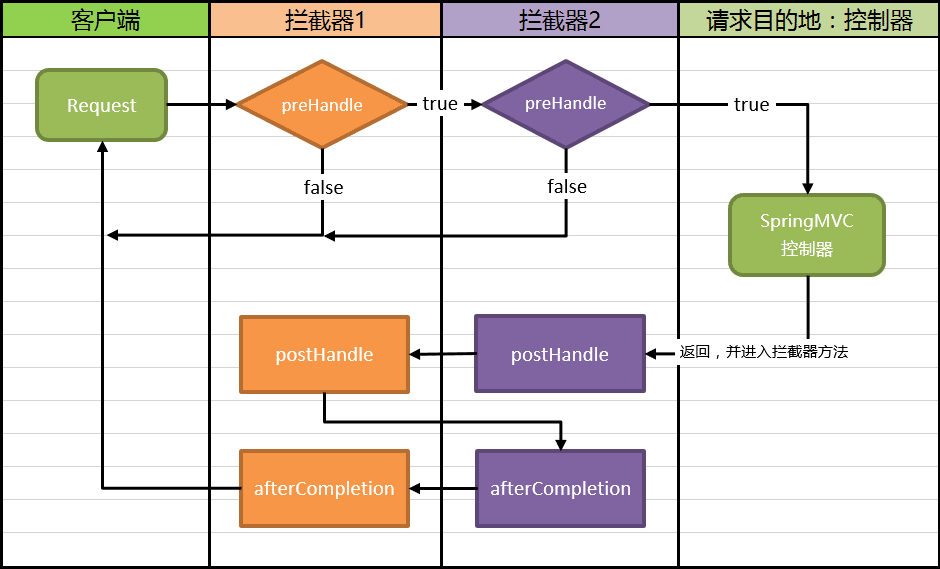

# 拦截器

```
interceptor
英 [ˌɪntəˈseptə(r)] 美 [ˌɪntərˈseptər]
n.截击机，拦截器
```

> [!TIP|style:flat|label:Interceptor]

> 拦截器是指通过统一拦截从浏览器发往服务器的请求来完成功能的增强。(相当于Node.js KOA2的中间件)

> 使用场景：解决请求的共性问题（如：乱码问题、权限验证问题等）


### 拦截器的基本工作原理

SpringMVC可以通过配置过滤器来解决乱码问题

拦截器的工作原理和过滤器非常相似

### 过滤器

src/main/webapp/WEB-INF/web.xml

```xml
  <servlet>
  	<servlet-name>viewSpace</servlet-name>
  	<servlet-class>org.springframework.web.servlet.DispatcherServlet</servlet-class>
  </servlet>
  
  <servlet-mapping>
  	<servlet-name>viewSpace</servlet-name>
  	<!-- <url-pattern>*.form</url-pattern> -->
  	<url-pattern>/</url-pattern>
  </servlet-mapping>
  
  <!-- 过滤器实现 src/main/webapp/WEB-INF/web.xml -->
  <filter>
  	<filter-name>encoding</filter-name>
  	<filter-class>org.springframework.web.filter.CharacterEncodingFilter</filter-class>
  	<init-param>
  		<param-name>encoding</param-name>
  		<param-value>utf8</param-value>
  	</init-param>
  </filter>
  
  <filter-mapping>
  	<filter-name>encoding</filter-name>
  	<url-pattern>*</url-pattern>
  </filter-mapping>
```

### 拦截器实现

1. 编写拦截器类实现HandlerInterceptor接口

2. 将拦截器注册进SpringMVC框架中

3. 配置拦截器规则

src/main/webapp/WEB-INF/viewSpace-servlet.xml

```xml
    <!-- 注册拦截器 -->
	<mvc:interceptors>
		<mvc:interceptor>
		    <!-- 配置拦截器规则 -->
			<mvc:mapping path="/**"/>
			<mvc:exclude-mapping path="/static/**"/>
			<bean class="com.zx.interceptor.ZxInterceptor"/>
		</mvc:interceptor>
	</mvc:interceptors>
```

```java
// 编写拦截器类实现HandlerInterceptor接口
package com.zx.interceptor;

import javax.servlet.http.HttpServletRequest;
import javax.servlet.http.HttpServletResponse;

import org.springframework.web.servlet.HandlerInterceptor;
import org.springframework.web.servlet.ModelAndView;

public class ZxInterceptor implements HandlerInterceptor {

  public boolean preHandle(HttpServletRequest request, HttpServletResponse response, Object handler) throws Exception {
    System.out.println("进入了preHandle");
    return true;
  }

  public void postHandle(HttpServletRequest request, HttpServletResponse response, Object handler,
    ModelAndView modelAndView) throws Exception {
    System.out.println("进入了postHandle");
  }

  public void afterCompletion(HttpServletRequest request, HttpServletResponse response, Object handler, Exception ex)
      throws Exception {
    System.out.println("进入了afterCompletion");
  }
  
}
```

结果：

```
进入了preHandle
进入了控制器view()方法...
name = null
pwd = null
进入了postHandle
进入了afterCompletion
```

### 拦截器方法介绍

preHandle 在请求被处理之前进行调用；返回 `false`，请求将被终止。

postHandle 在请求被处理之后进行调用。可以在此方法中修改数据等操作。

afterCompletion 在请求结束之后调用。可以在此做一些资源释放等操作。

src/main/java/com/zx/interceptor/ZxInterceptor.java

```java
package com.zx.interceptor;

import javax.servlet.http.HttpServletRequest;
import javax.servlet.http.HttpServletResponse;

import org.springframework.web.servlet.HandlerInterceptor;
import org.springframework.web.servlet.ModelAndView;

public class ZxInterceptor implements HandlerInterceptor {

  public boolean preHandle(HttpServletRequest request, HttpServletResponse response, Object handler) throws Exception {
    System.out.println("进入了preHandle");
    // 解决乱码问题
    // request.setCharacterEncoding("utf-8");
    
    // 解决权限验证问题
    if (request.getSession().getAttribute("user") == null) {
        // 如果用户没有登录，就终止请求
        // 并跳转只登录页面
        request.getRequsetDispatcher("/login.jsp").forward(request, response);
        return false;
    }
    return true;
  }

  public void postHandle(HttpServletRequest request, HttpServletResponse response, Object handler,
    ModelAndView modelAndView) throws Exception {
    System.out.println("进入了postHandle");
    modelAndView.addObject("name", "这里获取到的是被拦截器postHandle方法修改后的数据。");
  }

  public void afterCompletion(HttpServletRequest request, HttpServletResponse response, Object handler, Exception ex)
      throws Exception {
    System.out.println("进入了afterCompletion");
  }
  
}
```

src/main/java/com/zx/interceptor/controller/ZxInterceptorController.java

```java
package com.zx.interceptor.controller;

import org.springframework.stereotype.Controller;
import org.springframework.web.bind.annotation.RequestMapping;
import org.springframework.web.servlet.ModelAndView;

@Controller
@RequestMapping("/")
public class ZxInterceptorController {
  // localhost:8080/view?name=测试&pwd=456799
  @RequestMapping("/view")
  public ModelAndView view(String name, String pwd) {
    ModelAndView mv = new ModelAndView();
    System.out.println("进入了控制器view()方法...");
    System.out.println("name = " + name);
    System.out.println("pwd = " + pwd);
    mv.setViewName("index.jsp");
    mv.addObject("name", name);
    mv.addObject("password", pwd);
    return mv;
  }
}
```

src/main/webapp/index.jsp

```jsp
<h2>Hello World!</h2>
<div>${name}, ${password}</div>
```

### 多个拦截器配置

工作流程：



### 拦截器的其他实现方法

拦截器的类通过实现WebRequestInterceptor接口来编写。

配置文件SpringMVC框架注册写法不变。

缺点：preHandle方法没有返回值，不能终止请求。

src/main/java/com/zx/interceptor/ZxInterceptor2.java

```java
package com.zx.interceptor;

import org.springframework.ui.ModelMap;
import org.springframework.web.context.request.WebRequest;
import org.springframework.web.context.request.WebRequestInterceptor;

public class ZxInterceptor2 implements WebRequestInterceptor {

  public void preHandle(WebRequest request) throws Exception {
    // TODO Auto-generated method stub
    
  }

  public void postHandle(WebRequest request, ModelMap model) throws Exception {
    // TODO Auto-generated method stub
    
  }

  public void afterCompletion(WebRequest request, Exception ex) throws Exception {
    // TODO Auto-generated method stub
    
  }

}
```

### 拦截器的使用场景

使用原则：处理所有请求的共同问题

1. 解决乱码问题

2. 解决权限验证问题

### 拦截器和过滤器区别

过滤器Filter依赖于Servlet容器，基于回调函数，过滤范围大。

拦截器Interceptor依赖于框架容器，基于反射机制，只过滤请求。

### 总结

拦截器可以处理Web应用中请求的一些通用性问题。

共性问题在拦截器中处理，可以减少重复代码，便于维护。


