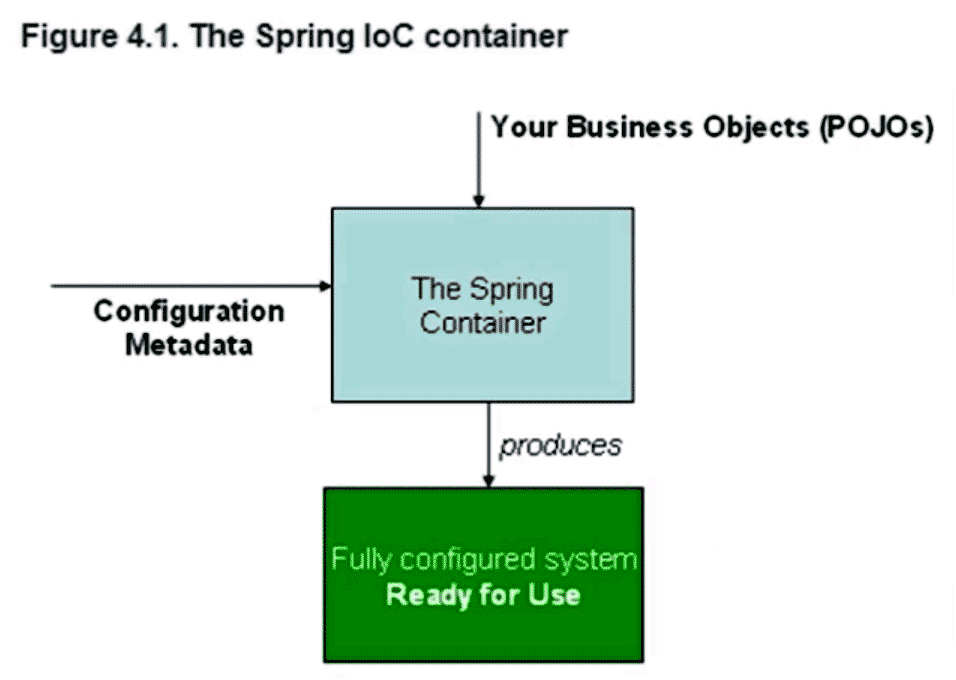

# IoC及bean容器

### 接口

* 用于沟通的中介物的抽象化

* 实体把自己提供给外界的一种抽象化说明，用以由内部操作分离出外部沟通方法，使其能被修改内部而不影响外界其他实体与其交换的方式

* 对应Java接口即声明，声明了哪些方法时对外公开提供的

* 在Java8中，接口可以拥有方法体

### 面向接口编程

* 结构设计中，分清层次及调用关系，每层只向外（上层）提供一组功能接口，各层间仅依赖接口而非实现类

* 接口实现的变动不影响各层间的调用，这一点在公共服务中尤为重要

* "面向接口编程"中的"接口"是用于隐藏具体实现和实现多态性的组件

OneInterface.java

```java
package com.test;

public interface OneInterface {
	String hello(String str);
}
```

OneInterfaceImpl.java

```java
package com.test;

public class OneInterfaceImpl implements OneInterface {
	@Override
	public String hello(String str) {
		return "Word from interface \"OneInterface\": " + str;
	}
}
```

Main.java

```java
package com.test;

public class Main {

	public static void main(String[] args) {
		OneInterfaceImpl oif = new OneInterfaceImpl();
		System.out.println(oif.hello("World"));
	}

}
```

### Spring的Bean配置

上面的接口在Spring中的配置方式

```xml
<?xml version="1.0" encoding="UTF-8"?>
<beans xmlns="...">
    <bean id="onInterface" class="com.test.OneInterfaceImpl"></bean>
</beans>
```

### IOC 控制反转

控制权的转移，应用程序本身不负责依赖对象的创建和维护，而是由外部容器负责创建和维护。

**DI(依赖注入Dependency Injection)**是其一种实现方式

**目的**创建对象并且组装对象之间的关系

比如我们住的房子，不会自己画图纸修建，而是之间找开发商或中介购买使用。



**扩展阅读**

* 百度百科 https://baike.baidu.com/item/%E6%8E%A7%E5%88%B6%E5%8F%8D%E8%BD%AC/1158025

* 浅谈IOC--说清楚IOC是什么 https://blog.csdn.net/ivan820819/article/details/79744797

*  什么是IOC(控制反转)、DI(依赖注入) https://blog.csdn.net/qq_42709262/article/details/81951402

### 扩展理解

2004年，Martin Fowler探讨了同一个问题，既然IOC是**控制反转**，那么到底是“哪些方便的控制被反转了？”。经过详细地分析和论证后，他得出答案：**获得依赖对象的过程被反转了**。控制被反转之后，获得依赖对象的过程由自身管理变为由IOC容器主动注入。

于是他给**控制反转**取了一个更合适的名字**依赖注入Dependency Injection**。他的这个答案实际上给出了实现IOC的方法：**注入**。所谓**依赖注入**，就是由IOC容器在运行期间，动态地将某种依赖关系注入到对象之中。

|房屋中介||IOC|
|:--|:--:|:--|
|找中介|=>|找IOC容器|
|中介介绍房子|=>|容器返回对象|
|租房、入住|=>|使用对象|

### 自从有了IOC之后

* 不必自己创建对象了

* IOC机制就提供了

* 面向接口编程了

* IOC藏实现了

* 不管对象了（不要自己去new 类）

* IOC管了

* 变好了

* IOC

* ...

### 单元测试

* 下载junit-*.jar并引入工程

* 创建UnitTestBase类，完成对Spring配置文件的加载、销毁

* 所有的单元测试类都继承自UnitTestBase，通过它的getBean方法获取想要得到的对象

* 子类（具体执行单元测试的类）加注解：@RunWith(BlockJUnit4ClassRunner.class)

* 单元测试方法加注解：@Test

* 右键选择要执行的单元测试方法执行或者执行一个类的全部单元测试方法

### Bean容器初始化

**基础：两个包**

* org.springframework.beans

* org.springframework.context

* BeanFactory提供配置结构和基本功能，加载并初始化Bean

* ApplicationContext保存了Bean对象并在Spring中被广泛使用

**初始化方式，ApplicationContext**

* 加载本地文件，即指定磁盘上的指定文件

```java
FileSystemXmlApplicationContext context = new FileSystemXmlApplicationContext("C:/workspace/app-context.xml");
```

* Classpath，相对路径，相对工程的一个路径

```java
// Classpath
ClassPathXmlApplicationContext context = new ClassPathXmlApplicationContext("classpath:spring-context.xml");
```

* Web应用中依赖Servlet或Listener

```xml
<listener>
    <listener-class>org.springframework.web.context.ContextLoaderListener</listener-class>
</listener>
<servlet>
    <servlet-name>context</servlet-name>
    <servlet-class>org.springframework.web.context.ContextLoaderServlet</servlet-class>
    <load-on-startup>1</load-on-startup>
</servlet>
```

### Spring注入

* Spring注入是指在启动Spring容器加载bean配置的时候，完成对变量的赋值行为

* 常用的两种注入方式：

设值注入

```xml
<?xml version="1.0" encoding="UTF-8"?>
<beans xmlns="http://www.springframework.org/schema/beans"
	xmlns:xsi="http://www.w3.org/2001/XMLSchema-instance"
	xsi:schemaLocation="http://www.springframework.org/schema/beans
	  http://www.springframework.org/schema/beans/spring-beans.xsd">
    <bean id="injectionService" class="com.test.service.InjectionServiceImpl">
        <property name="injectionDAO" ref="injectionDAO"></property>
    </bean>
    <bean id="injectionDAO" class="com.test.injection.dao.InjectionDAOImpl"></bean>
</beans>
```

构造注入

```xml
<?xml version="1.0" encoding="UTF-8"?>
<beans xmlns="...">
    <bean id="injectionService" class="com.test.service.InjectionServiceImpl">
        <constructor-arg name="injectionDAO" ref="injectionDAO"/>
    </bean>
    <bean id="injectionDAO" class="com.test.injection.dao.InjectionDAOImpl"></bean>
</beans>
```