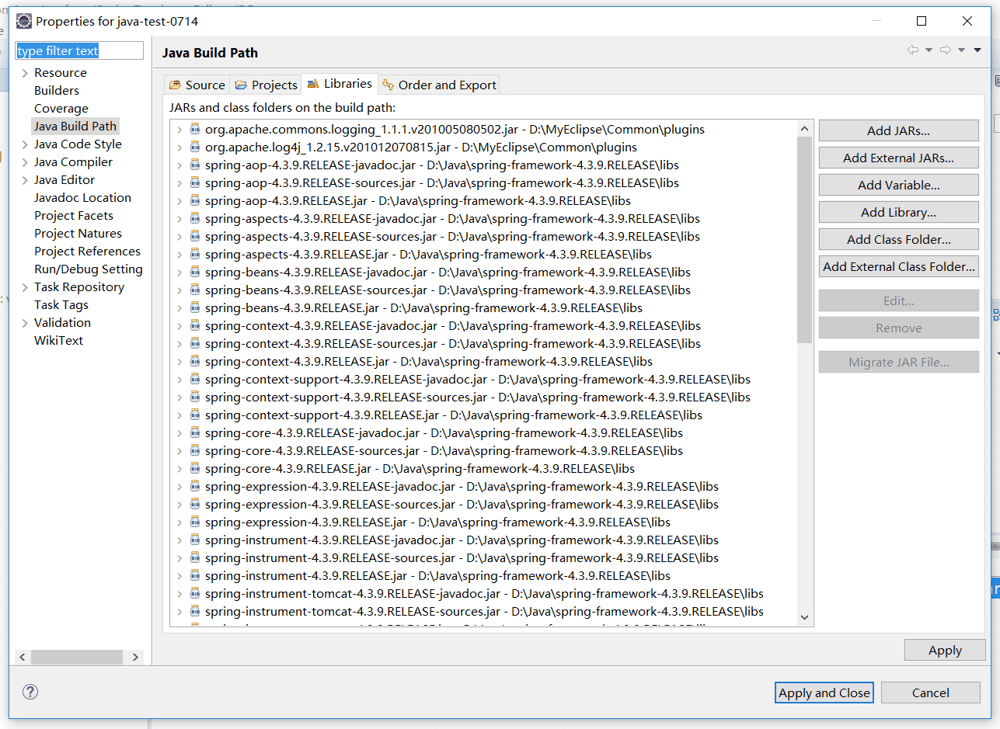

# JUnit4

https://github.com/junit-team/junit4

Eclipse Jee 2018-12中自动继承了JUnit4、5等

> [!WARNING|style:flat|label:注意]

> 测试用例不是用来证明程序是对的，而是用来证明程序没有错。

> 测试用例用来达到想要的预期结果，但对于逻辑错误无能为力。

src/

```java
package com.test.util;

public class Calculate {
	public int add(int a, int b) {
		return a + b;
	}
	
	public int subtract(int a, int b) {
		return a - b;
	}
	
	public int multiply(int a, int b) {
		return a * b;
	}
	
	public int divide(int a, int b) {
		return a / b;
	}
}
```

test/

```java
package com.test.util;

import static org.junit.Assert.*;
import org.junit.Test;

public class CalculateTest {

	@Test
	public void testAdd() {
		assertEquals(6, new Calculate().add(3, 3));
	}
	
	@Test
	public void testSubtract() {
		assertEquals(3, new Calculate().subtract(10, 7));
	}
	
	@Test
	public void testMultiply() {
		assertEquals(10, new Calculate().multiply(2, 5));
	}

	@Test
	public void testDivide() {
		assertEquals(10, new Calculate().divide(80, 8));
	}
}
```

> [!TIP|style:flat|label:总结]

> 1. 测试方法上必须使用@Test进行修饰

> 2. 测试方法必须使用public void进行修饰，不能带任何的参数

> 3. 新建一个源代码目录来存放我们的测试代码

> 4. 测试类的包，应和被测试类保持一致

> 5. 测试单元中的每个方法必须可以独立测试，测试方法间不能有任何的依赖

> 6. 测试类使用Test作为类名的后缀（非必须）

> 7. 测试方法使用test作为方法前缀（非必须）

### 测试失败的两种情况

```java
package com.test.util;

import static org.junit.Assert.*;
import org.junit.Test;

public class ErrorAndFailureTest {

	@Test
	public void testAdd() {
		assertEquals(5, new Calculate().add(3, 3));
	}

	@Test
	public void testDivide() {
		assertEquals(10, new Calculate().divide(80, 0));
	}

}
```

> [!TIP|style:flat|label:总结]

> 1. Failure一般由单元测试的断言方法判断失败所引起的，这经表示测试点发现了问题，即程序输出的结果和我们预期的不一样。
> 2. Error是由代码异常引起，可能是测试代码本身有错误，或是被测代码中有隐藏bug
> 3. 测试用例不是用来证明程序是对的，而是用来证明程序没有错误。
	 
### JUnit运行流程

```java
package com.test.util;

import static org.junit.Assert.*;

import org.junit.After;
import org.junit.AfterClass;
import org.junit.Before;
import org.junit.BeforeClass;
import org.junit.Test;

public class JUnitFlowTest {

	@BeforeClass
	public static void setUpBeforeClass() throws Exception {
		System.out.println("setUpBeforeClass");
	}

	@AfterClass
	public static void tearDownAfterClass() throws Exception {
		System.out.println("tearDownAfterClass");
	}

	@Before
	public void setUp() throws Exception {
		System.out.println("setUp");
	}

	@After
	public void tearDown() throws Exception {
		System.out.println("tearDown");
	}

	@Test
	public void test1() {
		System.out.println("test1");
	}

	@Test
	public void test2() {
		System.out.println("test2");
	}
}
```

结果：

```
setUpBeforeClass
setUp
test1
tearDown
setUp
test2
tearDown
tearDownAfterClass
```

> [!TIP|style:flat|label:总结]

> 1. @BeforeClass修饰的方法会在所有方法被调用前被执行，而且该方法时静态的，所以当测试类被加载后接着就会运行它。而且在内存中它只会存在一个实例，它比较适合加载配置文件。

> 2. @AfterClass所修饰的方法通常用来对资源的清理，如关闭数据库的连接。

> 3. @Before和@After会在每个测试方法的前后各执行一次。

### JUnit4常用注解

```
a notation
英 [ə nəʊˈteɪʃn]   美 [ə noʊˈteɪʃn] 记号
```

```java
package com.test.util;

import static org.junit.Assert.*;
import org.junit.Ignore;
import org.junit.Test;

public class AnotationTest {

	@Test(expected=ArithmeticException.class)
	public void testDivide() {
		assertEquals(10, new Calculate().divide(10, 0));
	}
	
	@Ignore
	@Test(timeout=1000)
	public void testWhile() {
		int i = 1;
		while(true) {
			System.out.println("run forevet " + i);
		}
	}
	
	/**
	 * 我们预期的是3秒，程序读取时间是2秒，达到了预期
	 */
	@Test(timeout=3000)
	public void testReadFile() {
		try {
			Thread.sleep(2000);
		} catch (InterruptedException e) {
			// TODO Auto-generated catch block
			e.printStackTrace();
		}
	}
}
```

|注释|说明|
|:--|:--|
|@Test|将一个普通方法修饰成为一个测试方法|
||@Test(expected=XX.class)异常捕获|
||@Test(timeout=毫秒)超时处理，如处理死循环，或性能测试等|
|@BeforeClass|它会在所有方法运行前被执行，static修饰|
|@AfterClass|它会在所有方法运行结束后被执行，static修饰|
|@Before|会在每一个测试方法运行前被执行一次|
|@After|会在每一个测试方法运行后被执行一次|
|@Ignore|所修饰的测试方法会被测试运行器忽略|
||@Ignore(message)|
|@RunWith|可以更改测试运行器org.junit.runner.Runner|

### JUnit4测试套件

```java
package com.test.util;

import org.junit.runner.RunWith;
import org.junit.runners.Suite;

@RunWith(Suite.class)
@Suite.SuiteClasses({TaskTest1.class, TaskTest2.class, TaskTest3.class})
public class SuiteTest {
}
```

TaskTest1, TaskTest2, TaskTest3

```java
package com.test.util;

import org.junit.Test;
public class TaskTest3 {
	@Test
	public void test() {
		System.out.println("This is TaskTest3");
	}
}
```

结果：

```
This is TaskTest1
This is TaskTest2
This is TaskTest3
```

> [!TIP|style:flat|label:总结]

> **测试套件就是组织测试类一起运行的**

> 写一个作为测试套件的入口类，这个类里不包含其他的方法

> 更改测试运行器Suite.class

> 将要测试的类作为数组传入到Suite.SuiteClasses({})

### JUnit4参数化设置

目的：解决以上大同小异的测试代码问题

```java
package com.test.util;

import static org.junit.Assert.*;

import java.util.Arrays;
import java.util.Collection;

import org.junit.Test;
import org.junit.runner.RunWith;
import org.junit.runners.Parameterized;
import org.junit.runners.Parameterized.Parameters;

@RunWith(Parameterized.class)
public class ParameterTest {
	int expected = 0;
	int input1 = 0;
	int input2 = 0;
	
	@Parameters
	public static Collection<Object[]> t() {
		return Arrays.asList(new Object[][] {
			{3, 1, 2},
			{4, 2, 2}
		});
	}

	public ParameterTest(int expected, int input1, int input2) {
		this.expected = expected;
		this.input1 = input1;
		this.input2 = input2;
	}
	
	@Test
	public void testAdd() {
		assertEquals(expected, new Calculate().add(input1, input2));
	}
}
```

> [!TIP|style:flat|label:总结]

> 1. 更改默认的测试运行器为@RunWith(Parameterized.class)

> 2. 声明变量来存放预期值和结果值

> 3. 声明一个返回值为Collection的公共静态方法，并使用@Parameters进行修饰

> 4. 为测试类声明一个带有参数的公共构造函数，并在其中为之声明变量赋值

### spring与hibernate的整合测试



**spring测试**

src/application-context.xml

```xml
<?xml version="1.0" encoding="UTF-8"?>
<beans
	xmlns="http://www.springframework.org/schema/beans"
	xmlns:xsi="http://www.w3.org/2001/XMLSchema-instance"
	xmlns:p="http://www.springframework.org/schema/p"
	xsi:schemaLocation="http://www.springframework.org/schema/beans
    http://www.springframework.org/schema/beans/spring-beans-3.0.xsd">
	<bean id="date" class="java.util.Date"></bean>
</beans>
```

test/

```java
package com.test.conform;

import static org.junit.Assert.*;

import java.util.Date;

import org.junit.BeforeClass;
import org.junit.Test;
import org.springframework.context.ApplicationContext;
import org.springframework.context.support.*;

public class SpringTest {
	
	private static ApplicationContext context = null;

	@BeforeClass
	public static void setUpBeforeClass() throws Exception {
		context = new ClassPathXmlApplicationContext("application-context.xml");
	}

	@Test
	public void test() {
		Date date = (Date)context.getBean("date");
		System.out.println(date);
	}

}
```

结果：

```
log4j:WARN No appenders could be found for logger (org.springframework.core.env.StandardEnvironment).
log4j:WARN Please initialize the log4j system properly.
Sun Jul 14 22:06:27 JST 2019
```

**spring与hibernate的整合测试**

未实现！