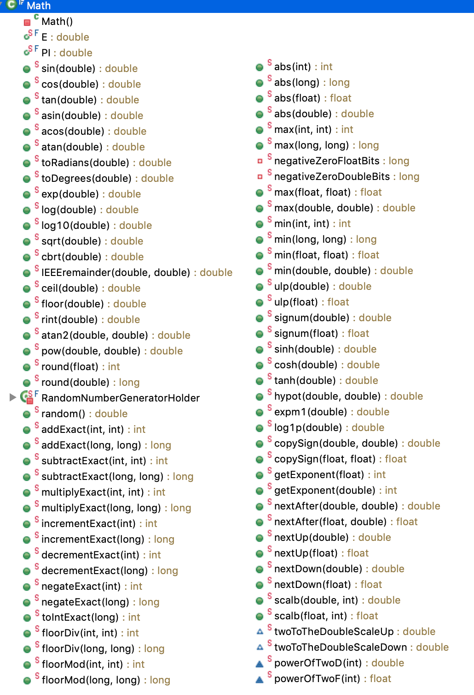

# Math类

Math 类位于 java.lang 包中，包含用于执行基本数学运算的方法， Math 类的所有方法都是静态方法，所以使用该类中的方法时，可以直接使用类名.方法名，如： Math.round();

|方法名|返回值|说明|
|:--|:--|:--|
|round()|long|返回四舍五入后的整数|
|floor()|double|返回小于参数的最大整数|
|ceil()|double|返回大于参数的最小整数|
|random()|double|返回[0, 1)之间的随机浮点数|

```java
public class MathTest {

	public static void main(String[] args) {
		double a = 23.92;
		int b = (int) a;
		System.out.println(a +"强制int类型转换：" + b);
		long c = Math.round(a);
		System.out.println("round("+ a +")四舍五入：" + c);
		double d = Math.floor(a);
		System.out.println("floor("+ a +")：" + d);
		double e = Math.ceil(a);
		System.out.println("ceil("+ a +")：" + e);
		double f = Math.random();
		System.out.println("random()：" + f);
	}

}
```

运行结果：

```
23.92强制int类型转换：23
round(23.92)四舍五入：24
floor(23.92)：23.0
ceil(23.92)：24.0
random()：0.5485492457892083
```

> [!TIP|style:flat|label:PS]

> Math 类还提供了许多其他方法，各位小伙伴们可以注意关注 wiki ，查阅更多信息。



练习

```java
public class MathTest2 {

	public static void main(String[] args) {
		// 定义一个整型数组，长度为10
		int[] nums = new int[10];

        // 通过循环给数组赋值
		for (int i = 0; i < nums.length; i++) {
            // 产生10以内的随机数
			int x = (int) (10 * Math.random());
			// 为元素赋值
			nums[i] = x;
		}

		// 使用foreach循环输出数组中的元素
		for (int num : nums) {
			System.out.print(num + " ");
		}
	}

}
```
