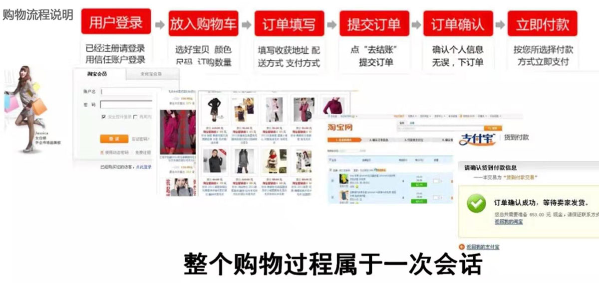
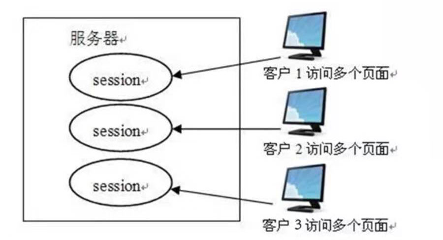

# JSP内置对象

* 内置对象简介

* 四种作用域范围

* out

* request/response

* session

* application

* 其它内置对象

* 项目案例

### 内置对象简介

是Web容器创建的一组对象，不使用new关键字就可以使用的内置对象。

```
<%
int[] value = {50, 60, 70};
for (int i : value) {
  out.println(i);
}
%>
```

> [!TIP|style:flat|label:JSP九大内置对象]

> **常用内置对象**

> out, request, response, session, application

> **其它内置对象**

> Page, pageContext, exception, config

Web程序的请求响应模式：用户发送请求(request)，服务器给用户响应(response)。

### 什么是缓冲区

缓冲区(Buffer)，所属缓冲区就是内存的一块区域，用来保存临时数据。

### out对象

是JspWriter类的实例，是向客户端输出内容常用的对象。

常用方法：

**void println()** 向客户端打印字符串。

**void clear()** 清除缓冲区的内容。注意，如果在flush之后调用会抛出异常。

**void clearBuffer()** 清除缓冲区的内容，不会向客户端输出任何内容。在flush之后调用不会抛出异常。

**void flush()** 将缓冲区内容输出到客户端。

**int getBufferSize()** 获取缓冲区字节数的大小，如不设置缓冲区则为0。

**int getRemaining()** 获取缓冲区剩余可用字节大小（可用空间）。

**boolean isAutoFlush()** 返回缓冲区满时，是自动清空还是抛出异常。

**void close()** 关闭输出流。

```
<body>
  <h1>out内置对象</h1>
  <%
    out.println("<h2>静夜思</h2>");
    out.println("床前明月光<br>");
    out.println("疑是地上霜<br>");
    out.println("举头望明月<br>");
    out.println("低头思故乡<br><br>");
  %>
  缓冲区大小：<%=out.getBufferSize() %>byte<br>
  缓冲区剩余空间：<%=out.getRemaining() %>byte<br>
  是否自动清空缓冲区：<%=out.isAutoFlush() %><br>
</body>
```

结果：

```
静夜思
床前明月光
疑是地上霜
举头望明月
低头思故乡

缓冲区大小：8192byte
缓冲区剩余空间：7513byte
是否自动清空缓冲区：true
```

使用 `out.flush()`

```
<body>
  <h1>out内置对象</h1>
  <%
    out.println("<h2>静夜思</h2>");
    out.println("床前明月光<br>");
    out.flush();
    out.println("疑是地上霜<br>");
    out.println("举头望明月<br>");
    out.println("低头思故乡<br><br>");
  %>
  缓冲区大小：<%=out.getBufferSize() %>byte<br>
  缓冲区剩余空间：<%=out.getRemaining() %>byte<br>
  是否自动清空缓冲区：<%=out.isAutoFlush() %><br>
</body>
```

结果：注意`缓冲区剩余空间`的值

```
静夜思
床前明月光
疑是地上霜
举头望明月
低头思故乡

缓冲区大小：8192byte
缓冲区剩余空间：8126byte
是否自动清空缓冲区：true
```

### get 与 post

```html
<form name="regForm" action="动作" method="GET或POST"></form>
```

```html
<body>
    <h2>GET</h2>
    <form action="logindo.jsp" method="get">
    	<p>用户名: <input type="text" name="username"></p>
    	<p>密 &nbsp;&nbsp;码: <input type="password" name="password"></p>
    	<p><input type="submit" value="登 录"></p>
    </form>
    <hr>
    
    <h2>POST</h2>
    <form action="logindo.jsp" method="post">
    	<p>用户名: <input type="text" name="username"></p>
    	<p>密 &nbsp;&nbsp;码: <input type="password" name="password"></p>
    	<p><input type="submit" value="登 录"></p>
    </form>
</body>
```

### request对象

> [!TIP|style:flat|label:request对象]

> 客户端的请求信息被封装在request对象中，通过它才能了解到客户端的需求，然后做出响应。

> 它是HttpServletRequest类的实例。

> 具有请求域，即完成客户端的请求之前，该对象一直有效。

常用方法如下：

**String getParameter(String name)** 返回name指定参数的值

**String[] getParameterValues(String name)** 返回包含参数name的所有值得数组

**void setAttribute(String name, Object obj);** 存储此请求中的属性。

**Object getAttribute(String name)** 返回指定属性的属性值

**String getContentType()** 得到请求体的MIME类型

**String getProtocol()** 获取请求用的协议类型及版本号

**String getServerName()** 返回接受请求的服务器主机名

```
<body>
    <h2>注册</h2>
    <form action="regdo.jsp" method="post">
    	<p>用户名: <input type="text" name="username"></p>
    	<p>
    		<label><input type="checkbox" name="favorite" value="读书"> 读书</label>
    		<label><input type="checkbox" name="favorite" value="写字"> 写字</label>
    		<label><input type="checkbox" name="favorite" value="看电影"> 看电影</label>
    		<label><input type="checkbox" name="favorite" value="音乐"> 音乐</label>
    		<label><input type="checkbox" name="favorite" value="跑步"> 跑步</label>
    		<label><input type="checkbox" name="favorite" value="旅游"> 旅游</label>
		</p>
    	<p><input type="submit" value="提 交"></p>
    </form>
    <hr>
    <a href="regdo.jsp?username=测试URL传参username">测试URL传参</a>
    
</body>
```

regdo.jsp

```
<body>
    <%
    	// post中文乱码处理，编码转换
    	request.setCharacterEncoding("utf-8");
    %>
    <p>用户名：<%=request.getParameter("username") %></p>
    <p>爱好：<%
    	// 空指针会抛出异常
    	if (request.getParameterValues("favorite") != null) {
	    	String[] favorites = request.getParameterValues("favorite");
	    	for (int i = 0; i < favorites.length; i++) {
	    		out.println(favorites[i] + "、");
	    	}
    	}
    %></p>
</body>
```

> [!WARNING|style:flat|label:注意]

> 通过URL传参中文乱码问题，可以在tomcat/conf/server.xml中设置编码。

```
<Connector port="8080" protocol="HTTP/1.1"
               connectionTimeout="20000"
               redirectPort="8443"
               URIEncoding="utf-8"/>
```

```
<%
    // void setAttribute(String name, Object obj);
    request.setAttribute("password", "123456789");
%>
<%
    // Object getAttribute(String name)
%>
<%=request.getAttribute("password") %>
```

其他方法及结果

```
# 方法 结果
getContentType null

getProtocol HTTP/1.1

getServerName localhost

getServerPort 8080

getContentLength -1

getRemoteAddr 0:0:0:0:0:0:0:1

getRealPath D:\Java\tomcat9\webapps\www\index.jsp

getContextPath /www

getScheme http
```

### response对象

> [!TIP|style:flat|label:response对象]

> response对象包含了响应客户端请求的相关信息，但在JSP中很少直接用到它。它是HttpServletResponse类的实例。

> response对象具有页面作用域，即访问一个页面时，该页面内的response对象只能对这次访问有效。其他页面的response对象对当前页面无效。

常用方法：

**String getCharacterEncoding()** 返回响应应用的是何种字符编码

**void setContentType(String type)** 设置响应的MIME类型

**PrintWriter getWriter()** 返回可以向客户端输出字符的一个对象（注意比较PrintWriter与内置out对象的区别）

> [!WARNING|style:flat|label:区别]

> PrintWriter outer = response.getWriter();

> 默认情况下，outer.println()该对象输出的内容，总是在内置对象out.println()之前。

> 可以通过 `out.flush()` 方法，实现按文档流输出。（见代码部分）

**sendRedirect(java.lang.String location)** 重新定向客户端的请求

response.jsp

```
<%@ page language="java" import="java.util.*,java.io.*" pageEncoding="UTF-8"%>
<%
	response.setContentType("text/html; charset=utf-8");
	
	out.println("<h2>response内置对象</h2>");
	out.println("<hr>");
	
	PrintWriter outer = response.getWriter();
	outer.println("这是response.getWriter()对象输出流");
%>
```

结果：

```
这是response.getWriter()对象输出流

<h2>response内置对象</h2>
<hr>
```

通过 `out.flush()` 方法，实现按文档流输出

```
<%@ page language="java" import="java.util.*,java.io.*" pageEncoding="UTF-8"%>
<%
	response.setContentType("text/html; charset=utf-8");
	
	out.println("<h2>response内置对象</h2>");
	out.println("<hr>");
	out.flush();
	
	PrintWriter outer = response.getWriter();
	outer.println("这是response.getWriter()对象输出流");
%>
```

结果：

```
<h2>response内置对象</h2>
<hr>
这是response.getWriter()对象输出流
```

### 请求重定向和请求转发

|名称|区别|
|:--|:--|
|请求重定向|客户端行为，response.sendRedirect()，从本质将等同于两次请求。前一次的请求对象不会保存，地址栏的URL会改变为定向地址。|
|请求转发|服务器行为，request.getRequestDispatcher().forward(req, res)。是一次请求，转发后请求对象会保存，URL地址不会改变。|

### session

> [!TIP|style:flat|label:session]

> session表示客户端与服务端的一次会话。

> Web中的session指的是用户在浏览某个网站时，从进入网站到浏览器关闭所经过的这段时间，也就是用户浏览这个网站所花费的时间。

> 从上述定义中可以看到，session实际上是一个特定的时间概念。

> 在服务器内存中，保存着不同用户(客户端)的session



在服务器内存中，保存着不同用户的session。



### 四种作用域范围


### application

### 其它内置对象

### 项目案例