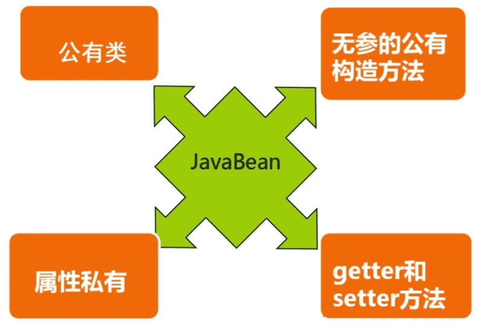

# JavaBean

是一种JAVA语言写成的可重用组件。为写成JavaBean，类必须是具体的和公共的，并且具有无参数的构造器。

JavaBean 通过提供符合一致性设计模式的公共方法将内部域暴露成员属性，set和get方法获取。众所周知，属性名称符合这种模式，其他Java 类可以通过自省机制(反射机制)发现和操作这些JavaBean 的属性。

> [!TIP|style:flat|label:JavaBeans]

> 就是符合某种特定的规范的java类。使用JavaBeans的好处是实现代码复用，减少冗余，功能区分明确，提高代码的可维护性。

### JavaBean设计原则



```java
// JavaBean设计原则实例：设计学生类
// 1.公有类
public class Students {
    // 2.属性私有
    private String name;
    private int age;
    // 3.无参的公共构造方法
    public Students() {
        // constructor
    }
    // 4.setter和getter方法
    public void setName(String name) { this.name = name; }
    public String getName() { return this.name; }
    public void setAge(int age) { this.age = age; }
    public int getAge() { return this.age; }
}
```

### Jsp动作

JSP动作元素(action elements)为请求处理阶段提供信息。动作元素遵循XML语法，有一个包含元素名的开始标签，可以有属性、可选的内容、与开始标签匹配的结束标签。

* 第一类与存取JavaBean有关的，包括：

```
<jsp:useBean>
<jsp:setProperty>
<jsp:getProperty>
```

* 第二类是JSP1.2就开始有的基本元素，包括6个动作元素

```
<jsp:include>
<jsp:forward>
<jsp:param>
<jsp:params>
<jsp:plugin>
<jsp:fallback>
```

* 第三类是JSP2.0新增的元素，主要与JSP Document有关，包括6个元素

```
<jsp:root>
<jsp:declaration>
<jsp:scriptlet>
<jsp:expression>
<jsp:text>
<jsp:output>
```

* 第四类是JSP2.0新增，主要是用来动态生成XML元素标签的值，包括3个动作

```
<jsp:attribute>
<jsp:body>
<jsp:element>
```

* 第五类是JSP2.0新增，主要是用在Tag File中，有2个元素

```
<jsp:invoke>
<jsp:dobody>
```