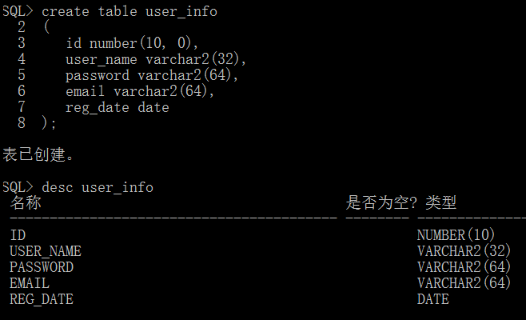

# 管理表

> [!TIP|style:flat|label:认识表]

> **表**是存储数据的基本存储单位

> **表**是**二维结构**，由行(记录)和列(域和字段)组成

### 约定

1、每一列数据必须具有相同数据类型。

2、列名是唯一的

3、每一行数据的唯一性

### 数据类型

字符型、数值型、日期型、其他类型。

|字符型|n最大值|说明|
|:--|:--|:--|
|CHAR(n)|2000|n为10时，输入长度3字符的字符将补齐7个空格，易造成空间浪费|
|NCHAR(n)|1000|按Unicode格式存放数据，常用于存储汉字|
|VARCHAR2(n)|4000|存储可变长度数据类型，相对CHAR更节约空间|
|NVARCHAR2(n)|2000|支持Unicode格式存放|

|数值型|说明|
|:--|:--|
|NUMBER(p,s)|p有效数字；s小数点后位数，支持正负数|
|FLOAT(n)|用于存储二进制数据，能表示二进制位数1-126位。转换成10进制，则需乘以0.30103|

```sql
NUMBER(5, 2)
# 有效数字5位，保留2位小数，如123.45
```

|日期型|说明|
|:--|:--|
|DATE|范围：公元前4712年1月1日，至公元9999年12月31日，精确到秒|
|TIMESTAMP||

|其他类型|最大能存储|说明|
|:--|:--|:--|
|BLOB|4GB数据|以二进制格式存储|
|CLOB|4GB数据|以字符串形式存储|

### 表的相关操作

创建表、修改表、删除表

**创建表语法**

```sql
CREATE TABLE table_name
(
    column_name datatype [default value], ...
)
# default 添加默认值，默认value获取系统当前时间sysdate
```

实例：



> [!TIP|style:flat|label:修改表]

> 添加字段、更改字段数据类型、修改字段名、删除字段、修改表名

**添加字段**

```sql
ALTER TABLE table_name
ADD column_name datatype [default value];
# alter table user_info add remark varchar2(500);
```

**更改字段数据类型**

```sql
ALTER TABLE table_name
MODIFY column_name datatype [default value];
# alter table user_info modify remark varchar2(300);
# alter table user_info modify password number(10, 0);
```

**删除字段**

```sql
ALTER TABLE table_name
DROP COLUMN column_name;
# alter table user_info drop column remark;
```

**修改字段名称**

```sql
ALTER TABLE table_name
RENAME COLUMN column_name TO new_column_name;
# alter table user_info rename column user_name to username;
```

**修改表名**

```sql
RENAME table_name TO new_table_name;
# rename user_info to userinfo;
```

> [!TIP|style:flat|label:删除表]

> 删除表中所有数据

> 删除表

**删除表中所有数据**

```sql
TRUNCATE TABLE table_name
```

**删除表**

```sql
DROP TABLE table_name
```

### 操作表中数据

添加数据：INSERT语句、操作实例、复制表数据

**INSERT语句**

```sql
# INSERT语句
INSERT INTO table_name
(column1, column2, ...)
VALUES(value1, value2, ...)
# column1 ...栏可以省略，但value栏的顺序必须与数据库表字段顺序一致
```

实例

**向表中所有字段添加值**

```sql
insert into user_info values(1, 'jock', '123456', '1522@qq.com', sysdate);
# sysdate 获取系统当前时间
```

**向表中指定字段添加值**

```
insert into user_info (id, user_name, password) values(2, 'tom', '123456');
```

**复制表数据**

```sql
# 在创建时复制
CREATE TABLE table_new
AS
SELECT column1, ...|* FROM table_old
# column 指定需要复制的字段
# * 代表复制所有字段数据
# create table new_userinfo as select * from user_info;
# create table new_userinfo2 as select id, user_name from user_info;
```

**在添加时复制**

```sql
INSERT INTO table_new
[(column1, ...)]
SELECT column1, ...|* FROM table_old
# 插入表的字段顺序及数据类型，需要与table_old表一致。
# insert into new_userinfo select * from user_info;
# insert into new_userinfo (id, user_name) select id, user_name from user_info;
```

**修改数据**

```
# UPDATE语句
UPDATE table_name
SET column1=value1, ... 
[WHERE conditions]
```

```
# 无条件更新
update user_info set password='1111111';
```

```
# 有条件更新
update user_info set password='222222', email='8888@xx.com' where id='2';
```

**删除数据**

```
# DELETE语句
DELETE FROM table_name
[WHERE conditions]
# drop删除表数据，要比delete快。
```

```
# 无条件删除
delete from user_info_copy;
```

```
# 有条件删除
delete from user_info where id='1';
```