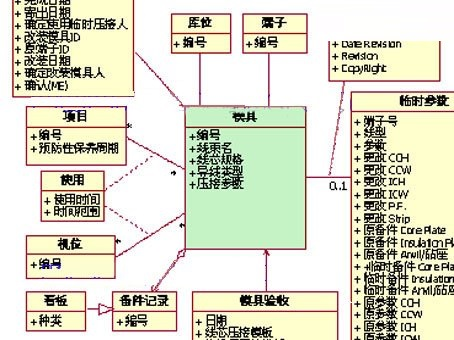
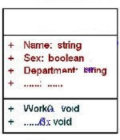
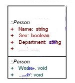
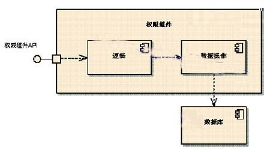
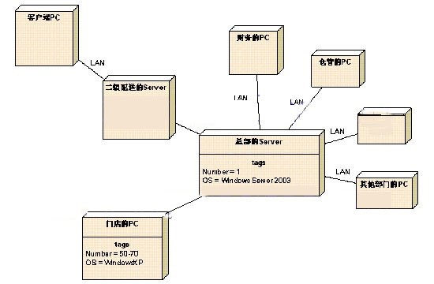
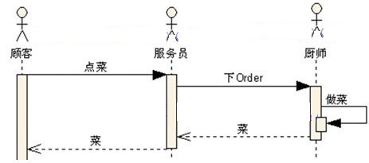
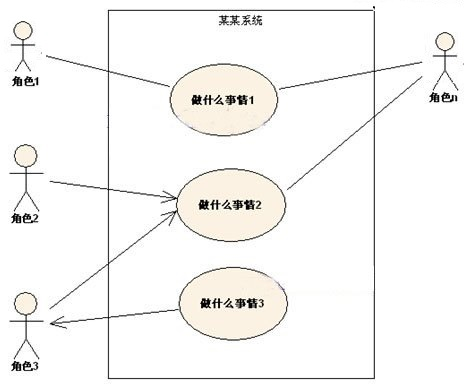
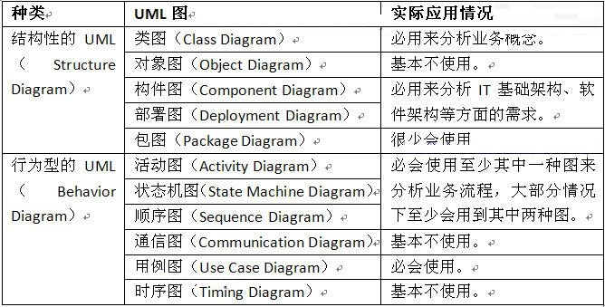

# UML

Unified Modeling Language（UML），统一建模语言或标准建模语言。

是一个支持模型化和软件系统开发的图形化语言。

为软件开发的所以阶段提供模型化和可视化支持。

### UML图示

UML 2.2一共定义了14中图示（diagrams）。

### 常用UML图


用例图（The Use Case Diagram）

> [!TIP|style:flat|label:The Use Case Diagram]

> 用例图能够以可视化的方式，表达系统如何满足所收集的业务规则，以及特定的用户需求等信息。


序列图（The Sequence Diagram）

> [!TIP|style:flat|label:The Sequence Diagram]

> 序列图用于安装交互发生的一系列顺序，显示对象之间的这些交互。


类图（The Class Diagram）

> [!TIP|style:flat|label:The Class Diagram]

> UML类图、业务逻辑和所有支持结构一同被用于定义全部的代码结构。

UML建模工具

Microsoft Office Visio、Rational Rose、PowerDesign三种建模工具应用最广。

参考资料：

https://www.cnblogs.com/Ph-one/p/7650624.html

https://www.eclipse.org/modeling/mdt/downloads/?project=uml2

https://www.cnblogs.com/silent2012/archive/2011/09/07/2169946.html

## UML学习入门就这一篇文章

转自：http://www.uml.org.cn/oobject/201309023.asp

### 1.1 UML基础知识扫盲

UML这三个字母的全称是Unified Modeling Language，直接翻译就是统一建模语言，简单地说就是一种有特殊用途的语言。

你可能会问：这明明是一种图形，为什么说是语言呢?伟大的汉字还不是从图形(象形文字)开始的吗?语言是包括文字和图形的!其实有很多内容文字是无法表达的，你见过建筑设计图纸吗?里面还不是很多图形，光用文字能表达清楚建筑设计吗?在建筑界，有一套标准来描述设计，同样道理，在软件开发界，我们也需要一套标准来帮助我们做好软件开发的工作。UML就是其中的一种标准，注意这可不是唯一标准，只是UML是大家比较推崇的一种标准而已，说不定以后有一个更好的标准可能会取代她呢!UML并不是强制性标准，没有法律规定你在软件开发中一定要用UML，不能用其它的，我们的目标是善用包括UML在内的各种标准，来提高我们软件开发的水平。

UML由1.0版发展到1.1、1.2、...，到现在的2.0、2.x，本书将会以2.x版本为基础开展讨论。网络上、书籍、还有各种UML工具软件，各自基于的UML版本可能会不一样，大家在学习过程中可能会有一些困惑，不过没关系，本课程在某些关键地方会描述1.x与2.x的差异。

##### UML有什么用?

有很多人认为，UML的主要用途就是软件设计!也有人认为，如果你不是开发人员，是难以理解UML的。

然而我第一次在实际工作中应用UML的却不是软件设计，而是软件需求分析!当时我们和客户面对面沟通调研需求的时候，直接用类图、顺序图、活动图、用例图等UML。我们并没有因此和客户无法沟通，反而是沟通得更加顺畅。客户在我们的引导下，很快就会读懂这些UML图，因为UML图，让我们和客户的沟通效率和效果更好!你可能觉得很神奇，在后续章节中，我将会为你逐一揭开神奇背后的“秘密”。

UML可帮助我们做软件需求分析和软件设计的工作，在我工作中大概各占了50%的比例，当然在你的实际工作中不一定是这样的比例。UML会让你的需求分析或者软件设计工作更上一层楼，本书将会介绍UML在需求分析方面的最佳实践。

告诉你一个秘密，UML应用于软件需求分析时，其学习门槛将会大大降低!语法复杂度会降低，而且你基本不需要掌握软件开发的知识。只要你对软件需求分析感兴趣，认真学习和应用UML，就很有机会成为软件需求分析高手。

##### UML的分类

结构型的图(Structure Diagram)

* 类图(Class Diagram)

* 对象图(Object Diagram)

* 构件图(Component Diagram)

* 部署图(Deployment Diagram)

* 包图(Package Diagram)

行为型的图(Behavior Diagram)

* 活动图(Activity Diagram)

* 状态机图(State Machine Diagram)

* 顺序图(Sequence Diagram)

* 通信图(Communication Diagram)

* 用例图(Use Case Diagram)

* 时序图(Timing Diagram)

##### 本书所描述的UML的各种图的名字，以上述的为准。

UML各种图的中文译名，因为翻译的原因可能会有所不一样，如：Sequence Diagram和Timing Diagram有时候都会被译成“时序图”，这是最让人困扰的地方!Sequence Diagram 除了被译为顺序图，还有序列图的译法。

中国软件行业协会(CSIA)与日本UML建模推进协会(UMTP)共同在中国推动的UML专家认证，两个协会共同颁发认证证书、两国互认，CSIA与UMTP共同推出了UML中文术语标准，该标准全称为：CSIA-UMTP UML中文术语标准v1.0(本书后文将会简称为UML中文术语标准)。本书将会遵循UML中文术语标准，并且我们会同时给出中文译名和英文原名，大家要留意看英文名字噢，这样能帮助你不会被众多的中文译名混淆。

##### UML图为什么会分为结构型和行为型两种呢?

顾名思义，结构型的图描述的是某种结构，这种结构在某段时间内应该是稳定的，“静态”的;而结构型的图描述的是某种行为，是“动态”的。

分析系统需求时，我们会面对很多业务概念，它们之间会有某些关系，这些内容可以看成是“静态”的，我们可以利用UML的结构性的图来分析。同时，业务会涉及大量的流程、过程等，这些内容是“动态”的，我们可以用行为型的UML图来分析。

在我们软件设计时，我们需要考虑需要那些类、哪些构件、系统最后怎样部署等，这些内容可以看成是“静态”的，我们可以利用UML的结构型的图来设计。同时，我们也需要考虑软件如何和用户交互，类、构件、模块之间如何联系等“动态”内容，我们可以利用行为型的图来设计。

所谓“静态”和“动态”不是绝对的，下文我们将会进一步介绍结构型的UML和行为型的UML。通过下面的学习，你将会初步认识UML的各种图，你可能还会有很多问题，本章的主要目的是让你对UML有一个宏观的认识，带着你的问题继续阅读后面的章节吧!

### 1.2 结构型的UML(Structure Diagram)

##### 类图(Class Diagram)



某模具系统类图

此图截取自某模具管理系统的业务概念分析图，图中一个一个的矩形就是类，这些类之间有各种线条连接，这些线条表示类之间的关系。类图是分析业务概念的首选，类图可能是使用率最高的UML图。

再看下面这个Person类图，这时软件设计时用到的一个图：



Person类图

该Person类有以下属性(Attribute)：Name(姓名),Sex(性别),Department(部门)等，有以下操作(Operation)：Work(工作)等。类有属性和操作，但用类图分析业务模型时，往往不需要使用操作，如图1.1中的类就只有属性。

Attribute有特性、特征等译法，Operation也称作方法，但本书遵循UML中文术语标准，即Attribute为属性，Operation为操作。

##### 对象图(Object Diagram)

一般情况下只有在软件开发中才会使用到对象图，下面的内容以开发的角度来说明对象图，如果你没有开发经验，阅读起来可能有一点难度。

图1.2中的Person类，用代码实例化如下：

```java
Person person = new Person();

……
```

类(Class)实例化后就是对象(Object)，对象person是类Person的实例，上述代码可以用对象图表示如下：



Person类的对象图

对象图和类图的样子很相似，对象是类的实例化，“person : Person”表示对象person是类Person的实例。对象图往往只在需要描述复杂算法时才会使用，画出来的对象图往往不会只有一个对象，该图只画了一个对象，其目的是尽量简化以便读者的理解什么是对象图。

在需求分析工作中基本上不需要使用对象图，从严谨的角度来看某些情况下应该使用对象图，但我往往还是会用类图来处理，这样更加简便而且容易理解。我们将在类图一章再次讲解对象图。

##### 构件图(Component Diagram)

构件图也叫组件图，两个名字均符合UML中文术语标准。

一辆汽车由轮子、发动机等物理部件组成，一个软件往往也是由很多“物理部件”(如：控件、重用构件等)组成的，构件图就是用来描述软件内部物理组成的一种图。下图是某权限构件设计图：



图1.4某权限构件设计图

图1.4右上方有这样标志 的矩形表示一个构件，构件可以再包含构件。

软件需求分析工作中，需要用到构件图的情况不是很多，以下情况除外：

1、待开发的系统需要与第三方的系统、原有系统、某些老系统等交互，这时可用构件图描述交互要求。

2、客户对软件设计有某些特殊要求，这时可用构件图来描述要求。

构件图有时不会单独使用，还会和部署图一起结合使用。

#### 部署图(Deployment Diagram)

部署图是用来描述系统如何部署、本系统与其他系统是怎样的关系的一种图，如下图：



图 1.5 某24小时便利店的管理系统部署图

图中一个个立体的矩形是部署图的“节点”，一个节点表示一个物理的设备，节点之间的线条表示节点间的物理连接关系。

大部分客户都会具备一定的IT基础环境(如具备局域网、一些服务器、某些软件平台等)，软件系统需要基于当前的IT基础环境来规划，这时我们可以使用部署图来做这个规划。

分析系统的需求，不能忽略系统架构、部署、IT架构等方面的要求，我们要基于客户当前的IT基础环境，做一个最符合客户利益的规划。

要活用构件图、部署图来分析需求，需要具备一定的IT基础架构知识和软件设计知识，如果你还不具备相关知识，那么可以考虑抓紧补充相关知识。不过需求分析工作更多的还是分析业务，提炼功能性需求，这部分工作能做好是相当不容易的事情。对于技术方面的非功能性需求分析，可交由有技术背景的专业人士负责。

##### 包图(Package Diagram)

Package有“打包”的意思，包图的主要用途是“打包”类图。用类图描述业务概念时，很多时候会因为业务类太多，而导致类图非常庞大，不利于阅读，这时可以将某些类放入“包”中，通过包图来组织业务概念图。

下图是包图的一个示例：


包图

图中好像文件夹样子的就是一个“包”，包之间的线条表示包之间的关系。

### 1.3 行为型的UML(Behavior Diagram)

活动图、状态机图、顺序图处于三种不同的角度来描述流程，是分析业务流程的三种不同利器，下面将会逐一说明。

##### 活动图(Activity Diagram)

我们将起床到出门上班这个过程画成活动图，可能是这样的：


图 1.7 起床到出门上班的活动图

活动图中的一个圆边框框表示一个“活动”，多个活动之间的带箭头线条表示活动的先后顺序，该图只是表达了一个顺序流程，活动图还可以表达分支结构。如果你以前曾学过流程图的话，你会发现活动图和流程图很相似。活动图可能是三种能表示流程的UML图中最接近我们思维习惯的一种，下面来学习另外两种能表达流程的图。

##### 状态机图(State Machine Diagram)

状态机图又叫状态图，但状态图这个译名并没有译出Machine的意思。

状态机图从某个物品的状态是如何变化的角度来展示流程，下图某请假条审批流程：


图 1.8 请假处理流程

整个请假审批流程是围绕“请假条”这个物体进行的，随着不同的审批阶段，请假条具备不同的状态。我们分析业务流程时会发现很多流程其实是围绕某个物品进行的，这时可考虑使用状态机图。

##### 顺序图(Sequence Diagram)

你去餐厅吃饭，向服务员点餐到服务员送菜上来，这个过程用顺序图可表示如下：



图 1.9 点菜的顺序图

该图有三个“小人”，每个“小人”下面的文字说明(如：顾客)表示其代表的角色。角色与角色之间有一些线条链接，表示角色之间是如何交互的。该图表示的意思是：顾客向服务员点菜后，服务员将点菜信息传递给厨师，然后厨师做菜，最后再由服务员送菜给你。

点菜过程涉及几个环节，每个环节均由不同的角色来负责，如果遇到类似的情况，你可以考虑使用顺序图来分析。用顺序图来分析的好处是能清晰表达整个过程所参与的角色，角色与角色之间的关系，各角色是如何被卷入这个过程当中的。

##### 通信图(Communication Diagram)

UML1.1时，该图英文名为Collaboration Diagram;UML2.x时，英文名为Communication Diagram。将英文名字直接翻译，原来的英文名字可译为协作图，而新的英文名字译为通信图。

通信图是顺序图的另外一种画法，点菜的顺序图，如果用通信图来画可表示如下：


图 1.10 点菜的通信图

三个“小人”分表表示三种角色：顾客、服务员、厨师;角色之间有直线联系表示他们之间有关系;带序号的文字和箭头，表示角色之间传递的信息。

顺序图更强调先后顺序，通信图更强调相互之间的关系。我觉得顺序图实用性更好一点，比通信图能表达更多的信息，更容易读懂，在需求分析工作中我基本不会使用通信图。

##### 用例图(Use Case Diagram)

下图是用例图的示意图：



图 1.11 用例图

用例图表达的是什么角色通过软件系统能做什么事情，我们可以使用用例图系统地表达软件系统的绝大部分需求。

##### 时序图(Timing Diagram)

时序图也叫时间图，时序图是UML中文术语标准的说法，而时间图不是标准的说法。

时序图是表示某东西的状态随时间变化而变化的一种图，参见下图：


图 1.12 灯的开关状态随时间变化图

此图表示在0秒到30秒，灯的状态是关的，30-60秒灯的状态为开，60秒后状态为关。

在实际工作中我基本上没有试用过时间图。

### 下面通过这个表格来总结一下我在需求分析工作中应用各种UML图的情况：



表 1.1 各种UML图实际应用情况

上表是根据我的工作经验总结的，相信会适用于很多情况。但每个人的工作经历、情况、环境等不太一样，上表仅作参考。

### 1.4 如何学好UML?

UML的认识误区

##### 误区一：认为UML主要用于软件设计。

前面的文章你可以看到，UML除了用于软件设计，还能用于需求分析，而本书就是专门来说明如何在需求分析工作中活用UML的。

##### 误区二：客户无法理解UML，在需求分析中应用UML实际意义不大。

我还不熟悉UML时，确实也有这样的怀疑，而实际工作中发现UML恰恰成为与客户沟通的良好桥梁!UML其实不难读懂，只要稍加解释客户马上就能读懂。我在所有的项目需求分析工作中，都直接使用UML图与客户沟通，并且给客户签署的需求规格说明书中含有大量的UML图。

UML能直观、形象、严谨地描述出业务概念、业务流程、客户的期望和需求，只要稍加引导客户，客户将会很容易读懂UML，甚至会主动使用UML与项目组交流。我曾经遇到过客户向我们索要画UML图的工具，客户见识过UML的威力后，也想在自己实际工作中使用。

##### 误区三：认为UML语法繁杂，难以学习和应用。

某些UML资料和书籍可能将UML说得过于复杂了，官方的UML标准资料也确实是枯燥难懂、人见人晕。我刚开始学习UML时，也看过一些UML书籍，觉得UML的语法太多、太复杂、太容易混淆了!

在实际工作中，其实经常需要用到的UML语法并不多，而且很容易掌握。当我们在需求分析方面应用UML时，需要掌握的语法更少(在软件设计方面应用UML时需要掌握稍多一点的语法)。“二八原则”在这里完全适用，我们经常用到的UML语法，其实只占全部语法的20%，而本书将会重点介绍实用性强的UML语法。

##### 误区四：UML用途不大。

很多人推崇UML，但也有不少人士不太认可UML。不认可的原因主要是因为一些人士学习UML后，发现在实际工作中发挥的作用并不是很大，有时候不用UML效果更好。

我不敢说UML能帮助我们解决所有问题，至少从我的多年使用经验上来说，UML对于提升我的需求分析能力帮助还是很大的。有人之所以感觉UML不太好用，我觉得原因还是只掌握了UML的形而没有领会UML的神。UML的常用语法可能几天就能学会了，而要真正做到“thinking in UML”却没有这么容易，需要长期的锻炼。

##### 我的学习经历

我读大学时没有听说过UML，出来工作两三年后才开始接触UML，当时的感觉就好像找到了新大陆，很想好好发掘一番!而我当时的运气还是相当不错的，我的上司是UML达人，他带领我参加了项目的需求分析工作。我很快就见识了UML威力，在他的言传身教之下，迅速掌握了UML。

在那个项目以后，我便独立担当了多个项目管理及需求分析工作，没有一个项目不应用UML，而且我毫不保留地传授UML知识给项目组的其他成员。多年的工作进一步磨练了自己，对UML在实际工作中的应用有了更深刻的认识，形成自己的一套方法。

我的UML知识绝大部分来自于工作实践，期间虽然也看过一些书籍，但对我的帮助很少。当然我最大的得益还是来自我的UML启蒙老师，他在实际工作中教会了我UML，帮助我踏上自我成长的道路。

我的UML学习最大体会就是：实践太重要了!如果有名师指导则会让你事半功倍!希望本书能成为你在实际工作中学习和应用UML的好帮手!

##### UML学习难点

学UML之难，不在于学习语法，关键是要改变思维习惯。UML是一种新的工具，但同时也是代表了一种新的先进的思考方法，如果不能掌握这样的方法，只能学到了UML的形，而没有掌握其神髓。

##### 要用好UML，你需要在平时多多培养下面的能力：

1、书面表达能力。

2、归纳总结能力。

3、“面向对象”的思维能力和抽象能力。

平时你可以利用各种机会来提升第1和第2种能力，如多写写项目文档、写写日记或博客等，多思考和总结平时自己的工作得失等。

第3种能力说起来有点虚，大家在大学中可能也学过相关知识。训练这种能力的最好方法就是多应用类图，我们将会在类图的章节再重点介绍，通过实例来体会什么才叫“面向对象”!

本书将会重点培养你的这三种能力，只要你有进步之心，多练习、多实践、多思考、多总结，一定会取得长足进步!

### 1.5 小结

本章的主要目标是让你不需要阅读全书的情况下，就可以了解到UML的全貌，大概知道UML各种图的用途，同时给你说明学习UML的难点，为最终活用UML做好准备。下面我们一起来复习一下本章的主要内容：

UML是Unified Modeling Language的简称，是软件开发界的一套标准，UML不仅可用于软件设计，也可以用于软件需求分析。但UML并不是强制标准，我们应该善用包括UML在内的各种标准来提高我们的水平。

UML可分为两类：结构型、行为型，结构性的UML有：类图、对象图、构件图、部署图、包图，行为型的图有活动图、状态机图、顺序图、通信图、用例图、时间图。

类图是业务概念模型分析的有利武器，也是面向对象分析能力的强有力训练工具。

对象图在需求分析工作中并不常用。

构件图、部署图是分析IT基础架构、软件架构等方面需求的有利分析工具，但需要你具备IT基础架构、软件设计方面的知识和经验。

包图可用来组织类图，在需求分析工作中应用的机会不是很大。

活动图、状态机图、顺序图是分析业务流程的强力武器。活动图的表达思路与流程图很类似，很容易掌握，而且大部分情况下都可以使用活动图来分析业务流程;某流程如果是围绕某个物品进行，该物品在流程中转换多种状态，那么使用状态机图来分析是首选;用顺序图来分析的好处是能清晰表达整个过程所参与的角色，角色与角色之间的关系，各角色是如何被卷入这个过程当中的。

通信图可以看作是顺序图的另外一种表达形式，顺序图更强调先后顺序，通信图更强调相互之间的关系。而从我的工作经验看，顺序图更加实用一点。

有人会将用例图称作“公仔图”，用例图表达的是什么角色通过软件系统能做什么事情，我们可以使用用例图系统地表达软件系统的绝大部分需求。

时间图是表示某东西的状态随时间变化而变化的一种图，我在实际工作中很少有机会能用到这种图。

学UML之难，不在于学习语法，避免陷入UML的认识误区，多练习、多实践，培养良好的“think in UML”思想，锻炼面向对象分析的能力，成为活用UML的需求分析高手不远矣!
