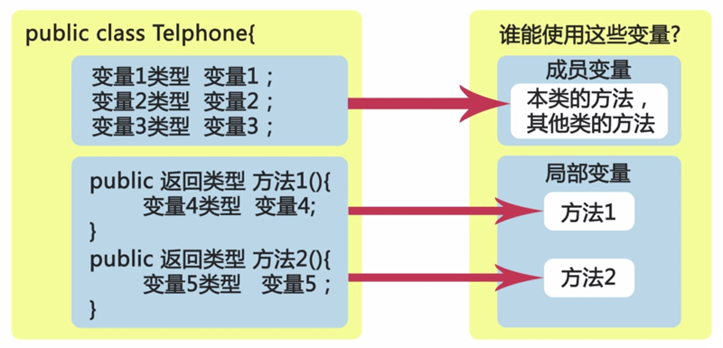
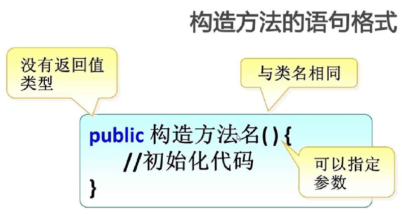

# 类和对象

面向对象

1、对象的概念

2、什么是面向对象

3、类

4、什么是对象的属性

5、什么是对象的方法

6、类与对象的关系/区别

### 对象的概念

万物皆对象，客观存在的事物皆为对象。

### 什么是面向对象

```
人 -> 关注 -> 事物信息
```

### 类

类是模子，确定对象将会拥有的特征（属性）和行为（方法）。

类的特点：类是对象的类型，具有相同属性和方法的一组对象的集合。

### 什么是对象的属性

属性：对象具有的各种特征，每个对象的每个属性都拥有特定值。

### 什么是对象的方法

方法：对象执行的操作。

### 类与对象的关系/区别

类是抽象的概念，仅仅是模板，比如说"手机"；

对象是一个你能够看得到，摸得着的具体实体。

|"手机"类|对象|
|:--|:--|
|特征（属性）屏幕/CPU/内存|华为, 小米...|
|行为（方法）打电话/发短信|华为, 小米...|

### 类的定义

类的重要性：所有Java程序都以 `类class` 为组织单元。

类的组成：属性和方法。

定义一个类的步骤：

```
定义类名，编写类的属性，编写类的方法
```

语法

```
public class 类名 {
    // 定义属性部分（成员变量）
    类型 属性1;
    类型 属性2;
    ...
    类型 属性n;

    // 定义方法部分
    方法1;
    方法2;
    ...
    方法n;
}
```

例子

```java
// Telphone.java
package com.phone;

// 1. 定义一个类Telphone
public class Telphone {
    // 2. 属性（成员变量）
    float screenSize;
    float cpu;
    float memory;

    // 3. 方法 干什么
    vodi call() {
      System.out.println("Telphone有打电话的功能");
    }

    vodi sendMessage() {
        System.out.println("Telphone有发短信的功能");
    }
}
```

### 使用对象

使用对象的步骤：

1、创建对象

```
类名 对象名 = new 类名();
```

```java
Telphone phone = new Telphone();
```

2、使用对象

```
引用对象的属性：对象名.属性
```

```
// 给screenSize属性赋值5
phone.screenSize = 5;
```

```
引用对象的方法：对象名.方法名()
```

```
// 调用sendMessage()方法
phone.sendMessage();
```

完整例子：

com.test/Telphone.java

```java
package com.test;

public class Telphone {
	float screenSize;
	float cpu;
	float memory;

	void call() {
		System.out.println("call");
	}

	void sendMessage() {
		System.out.println("screenSize: " + screenSize + ", cup: " + cpu + ", memory: " + memory);
	}
}
```

com.test/useTelphone.java

```
package com.test;

public class useTelphone {

	public static void main(String[] args) {
		// TODO Auto-generated method stub
		Telphone phone = new Telphone();
		phone.sendMessage();
		// 赋值
		phone.screenSize = 5.4f;
		phone.cpu = 1.4f;
		phone.memory = 4.0f;
		phone.sendMessage();
	}
}
```

### 成员变量和局部变量

1、成员变量：在 `类` 中定义，用了描述对象将要有什么。

2、局部变量：在类的 `方法` 中定义，在方法中临时保存数据。



#### 区别

||成员变量|局部变量|
|:--|:--|:--|
|作用域|在整个类内部都是可见的|仅限于定义它的方法中|
|初始值|Java会给成员变量一个初始值，调用时可以不赋值|不会赋初始值，调用前必须赋值|

同一个方法中，不允许有同名局部变量。

两类变量同名时，局部变量具有更高的优先级（就近原则）。

### 构造方法

1、使用`new 构造方法` 创建一个新的对象。

2、构造方法是定义在Java类中的一个用来初始化对象的方法，构造方法与类同名且没有返回值。



3、无参构造方法的使用

```
main():
    Telphone phone = new Telphone();

class Telphone:
    public Telphone() {
        System.out.println("Telphone Constractor");
    }
```

4、带参构造方法的使用

```
main():
    Telphone phone2 = new Telphone(5.0f);

class Telphone:
    public Telphone(float newScreen) {
        screen = newScreen;
    }
```

5、当没有指定构造方法时，系统会自动添加无参的构造方法。

6、当有指定构造方法，无论是有参、无参的构造方法，系统都不会自动添加无参的构造方法。

7、构造方法的重载：方法名相同，但参数不同的多个方法，调用时会自动根据不同的参数选择相应的方法。

8、构造方法不但可以给对象的属性赋值，还可以保证给对象的属性赋一个合理的值

```
// Tp.java
package com.test

pubilc class Tp {
    private float screen;

    public Tp() {
        System.out.println("com.test Tp无参构造方法执行了");
    }

    public Tp(float newScreen) {
        if (newScreen < 3.5f) {
            screen = 3.5f;
        } else {
            screen = newScreen;
        }
        System.out.println("有参的构造方法，screen: " + screen);
    }
}
```

### Java 中的 static 使用之静态变量

Java 中被 `static` 修饰的成员称为静态成员或类成员。它属于整个类所有，而不是某个对象所有，即被类的所有对象所共享。静态成员可以使用类名直接访问，也可以使用对象名进行访问。当然，鉴于他作用的特殊性更推荐用类名访问~~

使用 static 可以修饰变量、方法和代码块。


> [!WARNING|style:flat|label:注意]

> 静态成员属于整个类，当系统第一次使用该类时，就会为其分配内存空间直到该类被卸载才会进行资源回收！

### Java 中的 static 使用之静态方法

与静态变量一样，使用 static 修饰的方法，称为静态方法或类方法。比如之前使用的 main 方法就是静态方法。静态方法的使用如：


1、静态方法中可以直接调用同类中的 `静态成员`，但不能直接调用 `非静态成员`。


如果希望在静态方法中调用非静态变量，可以通过创建类的对象，然后通过对象来访问非静态变量


2、在普通成员方法中，则可以直接访问 `同类` 的非静态变量和静态变量


3、静态方法中不能直接调用非静态方法，需要通过对象来访问非静态方法


### Java 中的 static 使用之静态初始化块

Java 中可以通过初始化块进行数据赋值

```java
public class Hello {
    String name; // 定义一个成员变量
    // 通过初始化块，为成员变量赋值
    {
        name = "hello";
    }
}
```

在类的声明中，可以包含多个初始化块，当创建类的实例时，就会依次执行这些代码块。如果使用 static 修饰初始化块，就称为静态初始化块。

> [!WARNING|label:注意|style:flat]

> 静态初始化块只在 `类加载时执行`，且 `只会执行一次`，同时静态初始化块 `只能给静态变量赋值`，不能初始化普通的成员变量。


结果：


通过输出结果，我们可以看到，程序运行时`静态初始化块`最先被执行，然后执行`普通初始化块`，最后才执行`构造方法`。由于静态初始化块只在类加载时执行一次，所以当再次创建对象 hello2 时并未执行静态初始化块。

代码

```java
package com.test2;

public class HelloWorld {
	int num1;
	int num2;
	static int num3;
	public HelloWorld () {
		num1 = 91;
		System.out.println("通过构造方法为变量num1赋值");
	}
	{
		num2 = 74;
		System.out.println("通过初始化块为变量num2赋值");
	}
	static {
		num3 = 3;
		System.out.println("通过静态初始化块为静态变量num3赋值");
	}
	public static void main (String[] args) {
		HelloWorld h = new HelloWorld();
		System.out.println("num1: " + h.num1);
		System.out.println("num2: " + h.num2);
		System.out.println("num3: " + HelloWorld.num3);
		HelloWorld h2 = new HelloWorld();
	}
}
```

结果

```
通过静态初始化块为静态变量num3赋值
通过初始化块为变量num2赋值
通过构造方法为变量num1赋值
num1: 91
num2: 74
num3: 3
通过初始化块为变量num2赋值
通过构造方法为变量num1赋值
```

### 原教程出处

https://www.imooc.com/learn/124
