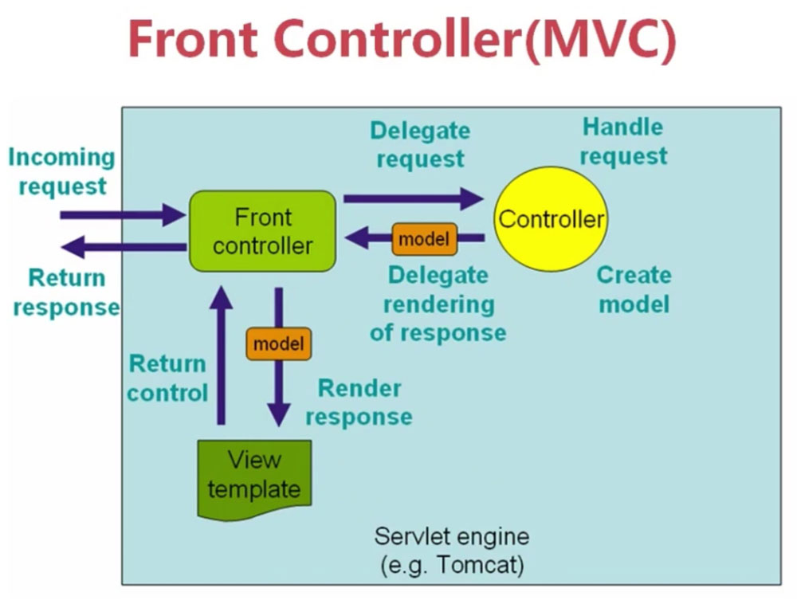
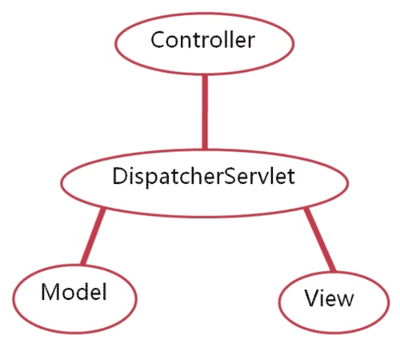
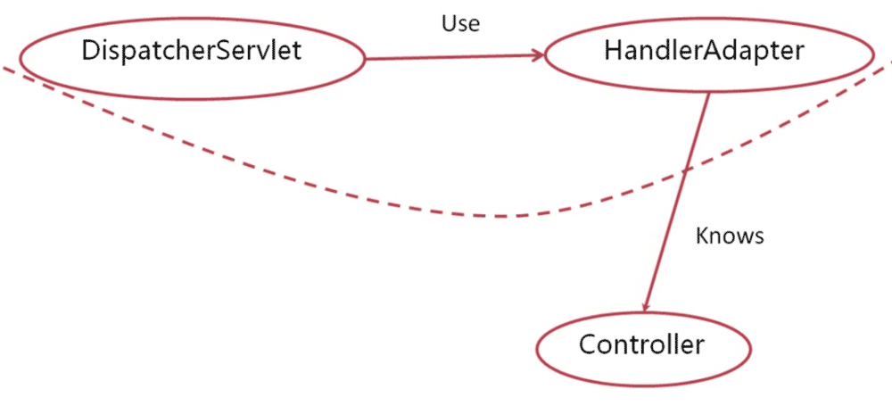
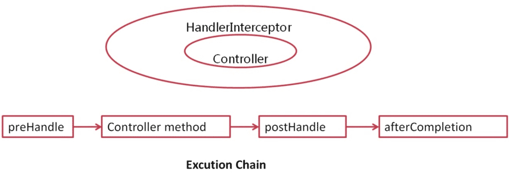
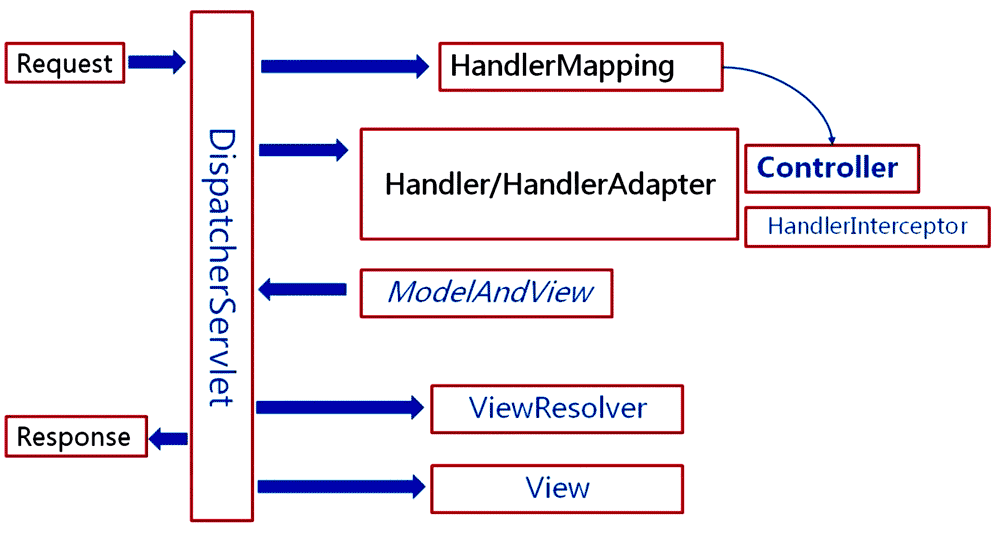

# Spring MVC起步



* Font Controller分发调度

* Controller 业务数据抽取

* View template 页面呈现

**MVC**的核心思想是业务数据抽取同业务数据呈现相分离

### MVC

Model-View-Controller

**视图层**为用户提供UI，重点关注数据的呈现

**模型层**业务数据的信息表示，关注支持的信息构成，通常是多个业务实体的组合。

**控制层**调用业务逻辑产生合适的数据(Model)传递给视图层用于呈现

> [!TIP|style:flat|label:MVC]

> **MVC是一种架构模式**

> 程序分层，分工合作，既相互独立，又协同工作。

> **MVC是一种思考方式**

> 需要将什么信息展示给用户？如何布局？调用哪些业务逻辑？

### Spring MVC静态概念

* DispatcherServlet



* Controller

* HandlerAdapter：DispatcherServlet内部使用类，就是Controller的一个表现形式



```
adapter 英 [əˈdæptə]   美 [əˈdæptər]  
n.(电器设备的)转接器，适配器;改编者;改写者
```

扩展阅读：适配器模式 https://blog.csdn.net/zxt0601/article/details/52848004

* HandlerInterceptor

* HandlerMapping 告诉Controller用哪一个Controller1来响应请求

* HandlerExecutionChain



内部实现使用的是Java的反射机制

* ModelAndView model的具体表现

* ViewResolver 视图解析器，通知Dispatcher使用哪个视图来呈现；作用：根据我们的配置，找出对应的视图对象

* View 

### Spring MVC动态概念



### 资源

https://www.imooc.com/learn/47