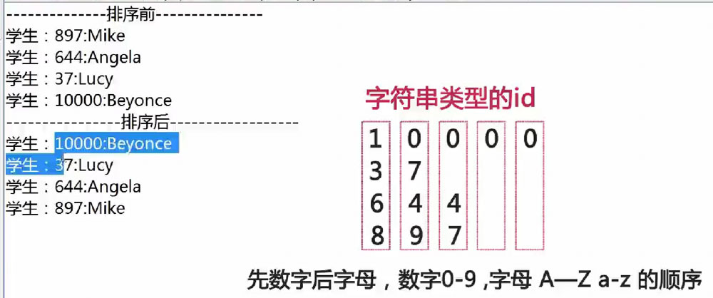

# Collections工具类

```
java.util.Collections
```

是Java集合框架中，用来操作集合对象的工具类；也是Java集合框架的成员。

## Comparable和Comparator

Comparable: 默认比较规则；

Comparator: 临时比较规则；

Comparable和Comparator都是Java集合框架的成员。

### Comparable接口 —— 可比较的

实现该接口表示：这个类的实例可以比较大小，可以进行自然排序

定义了默认的比较规则

其实现类需要实现compareTo()方法

compareTo()方法返回正数表示大，负数表示小，0则表示相等。


```java
import java.util.ArrayList;
import java.util.Collections;
import java.util.List;
import java.util.Random;

/**
 * 需求：
 * 1、通过Collections.sort()方法，对Integer泛型的List进行排序；
 * 2、对String泛型的List进行排序；
 * 3、对其他类型泛型的List进行排序，以Student2为列
 */
public class TestCollection {

	/**
	 * 1、通过Collections.sort()方法，对Integer泛型的List进行排序；
	 * 创建Integer泛型的List，插入10个100以内的不重复随机整数
	 * 调用Collections.sort()方法对其进行排序
	 */
	public void testSort1() {
		List<Integer> integerList = new ArrayList<Integer>();
		// 插入十个100以内的不重复随机整数
		Random random = new Random();
		Integer k;
		for (int i = 0; i < 10; i++) {
			do {
				k = random.nextInt(100);
			} while (integerList.contains(k));
			integerList.add(k);
			System.out.println("成功添加整数：" + k);
		}
		System.out.println("------- before sort -------");
		StringBuilder str1 = new StringBuilder();
		for (Integer integer : integerList) {
			str1.append(integer + " ");
		}
		System.out.println(str1);
		// 排序
		System.out.println("------- after sort -------");
		Collections.sort(integerList);
		StringBuilder str2 = new StringBuilder();
		for (Integer integer : integerList) {
			str2.append(integer + " ");
		}
		System.out.println(str2);
	}

	/**
	 * 2、对String泛型的List进行排序；
	 * 创建String泛型的List，添加3个乱序的String元素
	 * 调用sort方法，再次输出排序后的顺序
	 */
	public void testSort2() {
		List<String> stringList = new ArrayList<String>();
		stringList.add("huawei");
		stringList.add("alibaba");
		stringList.add("jingdong");
		System.out.println("------- before sort -------");
		StringBuilder str1 = new StringBuilder();
		for (String str : stringList) {
			str1.append(str + " ");
		}
		System.out.println(str1);
		// 排序
		System.out.println("------- after sort -------");
		// string排序规则
		// 0-9，A-Z，a-z
		Collections.sort(stringList);
		StringBuilder str2 = new StringBuilder();
		for (String str : stringList) {
			str2.append(str + " ");
		}
		System.out.println(str2);
	}

	/**
	 * 3、对其他类型泛型的List进行排序，以Student2为列
	 * Comparable和Comparator
	 */
	public void testSort3() {
		List<Student> studentList = new ArrayList<Student>();
		Random random = new Random();
		studentList.add(new Student(random.nextInt(1000), "Jack"));
		studentList.add(new Student(random.nextInt(1000), "Maria"));
		studentList.add(new Student(random.nextInt(1000), "Tomson"));
		System.out.println("------- before sort -------");
		StringBuilder str1 = new StringBuilder();
		for (Student st : studentList) {
			str1.append(st.id + ":" + st.name + " ");
		}
		System.out.println(str1);
		System.out.println("------- after sort -------");
		// 未实现Comparable接口前，会报以下错误：
		// [WARNING:The method sort(List<T>) in the type Collections is not applicable for the arguments (List<Student>)]
		Collections.sort(studentList);
		StringBuilder str2 = new StringBuilder();
		for (Student st : studentList) {
			str2.append(st.id + ":" + st.name + " ");
		}
		System.out.println(str2);
	}

	public static void main(String[] args) {
		TestCollection tc = new TestCollection();
		tc.testSort1();
		tc.testSort2();
		tc.testSort3();
	}

}
```

Student类

```java
import java.util.HashSet;
import java.util.Set;

/**
 * 学生类
 * @author capricorncd
 *
 */
public class Student implements Comparable<Student> {
	public int id;
	public String name;
	public Set<Course> courses;

	@Override
	public int hashCode() {
		final int prime = 31;
		int result = 1;
		result = prime * result + ((name == null) ? 0 : name.hashCode());
		return result;
	}

	@Override
	public boolean equals(Object obj) {
		if (this == obj)
			return true;
		if (obj == null)
			return false;
		if (!(obj instanceof Student))
			return false;
		Student other = (Student) obj;
		if (name == null) {
			if (other.name != null)
				return false;
		} else if (!name.equals(other.name))
			return false;
		return true;
	}

	public Student (int id, String name) {
		this.id = id;
		this.name = name;
		//  初始化
		this.courses = new HashSet<Course>();
	}

	@Override
	public int compareTo(Student o) {
		// String
		// return this.name.compareTo(o.name);
		return this.id - o.id;
	}
}
```

注意：当id为String类型时，其结果：



> [!NOTE|style:flat|label:扩展练习]

> 利用Collections.sort()方法，对泛型为String的List进行排序

> * 创建完List<String>后，往其中添加10条随机字符串

> * 每条字符串长度为10以内的随机整数

> * 每条字符串的每个字符都为随机生成的字符，字符可以重复

> * 每条随机字符串不可重复

### Comparator接口 —— 比较工具接口

用户定义**临时**比较规则，而不是默认比较规则。

其实现类需要实现compare()方法。

可以将Comparator传递给sort方法（如Collections.sort或Arrays.sort）

```java
package com.test.collection;

import java.util.Comparator;

public class StudentComparator implements Comparator<Student> {

	@Override
	public int compare(Student o1, Student o2) {
		// 按学生姓名排序
		return o1.name.compareTo(o2.name);
	}

}
```

改造TestCollection类testSrot3方法

```java
/**
 * 3、对其他类型泛型的List进行排序，以Student2为列
 * Comparable和Comparator
 */
public void testSort3() {
    List<Student> studentList = new ArrayList<Student>();
    Random random = new Random();
    studentList.add(new Student(random.nextInt(1000), "Jack"));
    studentList.add(new Student(random.nextInt(1000), "Maria"));
    studentList.add(new Student(random.nextInt(1000), "Tomson"));
    System.out.println("------- before sort -------");
    StringBuilder str1 = new StringBuilder();
    for (Student st : studentList) {
        str1.append(st.id + ":" + st.name + " ");
    }
    System.out.println(str1);
    // id排序
    System.out.println("------- after sort -------");
    // 未实现Comparable接口前，会报以下错误：
    // [WARNING:The method sort(List<T>) in the type Collections is not applicable for the arguments (List<Student>)]
    Collections.sort(studentList);
    StringBuilder str2 = new StringBuilder();
    for (Student st : studentList) {
        str2.append(st.id + ":" + st.name + " ");
    }
    System.out.println(str2);
    // 姓名排序
    System.out.println("------- sort by name -------");
    Collections.sort(studentList, new StudentComparator());
    StringBuilder str3 = new StringBuilder();
    for (Student st : studentList) {
        str3.append(st.id + ":" + st.name + " ");
    }
    System.out.println(str3);
}
```

运行结果：

```
------- before sort -------
894:Jack 210:Maria 968:Tomson
------- after sort -------
210:Maria 894:Jack 968:Tomson
------- sort by name -------
894:Jack 210:Maria 968:Tomson
```
