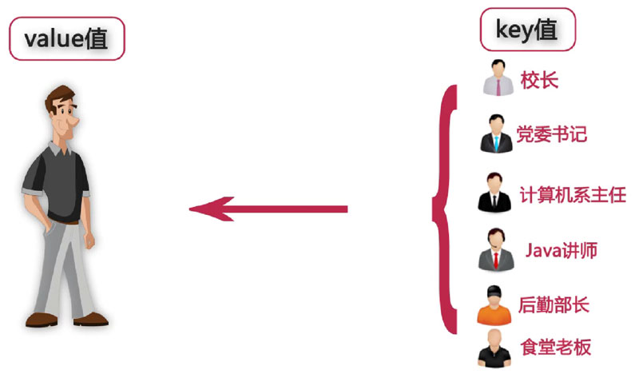
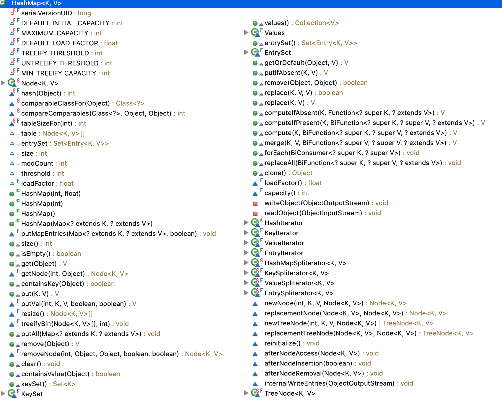

# Map & HashMap

## Map接口

Map提供了一种 `映射关系`，其中的元素以键值对（key-value）的形式存储，能够实现根据key快速查找value。

key/value可以是任意类型的对象。并且可以根据key值，快速找查找到对应的value值。

Map中的键值对以Entry类型的对象实例形式存在。

键（key值）不可重复，value值可以。每个键最多只能映射到一个值。



Map支持泛型，形式如：`Map<K, V>`

## HashMap类

HashMap是Map的一个重要实现类，也是最常用的，基于哈希表实现。

HashMap中的Entry对象是无序排列的。

Key值和Value值都可以为null，但是一个HashMap只能有一个key值的null的映射（key值不可重复）。



> [!NOTE|label:案例功能说明]

> 通过Map<String, Student>进行学生信息管理，其中key为学生ID，value为学生对象。

> 通过键盘输入学生信息。

> 对集合中的学生信息进行增/删/改/查操作。

Student2类

```java
import java.util.HashSet;
import java.util.Set;

public class Student2 {
	public String id;
	public String name;
	public Set<Course> courses;

	public Student2(String id, String name) {
		this.id = id;
		this.name = name;
		this.courses = new HashSet<Course>();
	}
}
```

TestMap类

```java
import java.util.HashMap;
import java.util.Map;
import java.util.Map.Entry;
import java.util.Scanner;
import java.util.Set;

public class TestMap {

	// 承装学生类型对象
	public Map<String, Student2> students;

	/**
	 * 创建构造函数，并初始化students属性
	 */
	public TestMap() {
		this.students = new HashMap<String, Student2>();
	}

	/**
	 * 添加学生数据：输入学生ID，判断是否被占用
	 * 若未被占用，则输入姓名，创建新学生对象，
	 * 并且添加到students中
	 */
	public void testPut() {
		//  创建一个Scanner对象，用于获取输入的学生ID和姓名
		Scanner console = new Scanner(System.in);
		int i = 0;
		while (i < 3) {
			System.out.println("请输入学生ID：");
			String ID = console.next();
			// 判断学生ID是否已被使用
			Student2 st = students.get(ID);
			if (st == null) {
				System.out.println("请输入学生姓名：");
				String name = console.next();
				// 创建新的学生对象
				Student2 newStudent = new Student2(ID, name);
				// 通过调用students的put方法，添加ID-学生对象映射
				students.put(ID, newStudent);
				System.out.println("成功添加学生：" + students.get(ID).name);
				i++;
			} else {
				System.out.println("该ID已被占用！");
				continue;
			}
		}
	}

	/**
	 * 参数Map的keySet方法
	 */
	public void testKeySet() {
		System.out.println("---------- testKeySet ----------");
		// 通过keySet方法，返回Map中的所有“键”的Set集合
		Set<String> studentKeys = students.keySet();
		// 遍历keySet，取得每一个键，再调用get方法，获取对应value值
		for (String studentID : studentKeys) {
			Student2 st = students.get(studentID);
			if (st != null) {
				System.out.println("学生：" + st.id + ":" + st.name);
			}
		}
		System.out.println("------ 共有" + students.size() + "位学生。");
	}

	/**
	 * 测试Map的remove方法
	 */
	public void testRemove() {
		Scanner console = new Scanner(System.in);
		while(true) {
			System.out.println("请输入需要删除的学生ID：");
			String ID = console.next();
			Student2 st = students.get(ID);
			if (st != null) {
				students.remove(ID);
				System.out.println("成功删除学生：" + st.name);
				break;
			} else {
				System.out.println("ID对应的学生不存在！");
				continue;
			}
		}
	}

	/**
	 * 测试Map的entrySet方法
	 */
	public void testEntrySet() {
		System.out.println("---------- testEntrySet ----------");
		// 通过entrySet方法，返回Map中的所有键值对
		Set<Entry<String, Student2>> entrySet = students.entrySet();
		for (Entry<String, Student2> entry : entrySet) {
			System.out.println("取得键值对：" + entry.getKey() + "=>" + entry.getValue().name);
		}
	}

	/**
	 * 测试put修改内容
	 */
	public void testModify() {
		System.out.println("请输入需要修改的学生ID：");
		Scanner console = new Scanner(System.in);
		while (true) {
			String studentID = console.next();
			Student2 st = students.get(studentID);
			if (st == null) {
				System.out.println("输入的学生ID不存在，请重新输入：");
				continue;
			}
			System.out.println("当前学生ID，对应的学生为：" + st.name);
			System.out.println("请输入新的学生姓名：");
			String name = console.next();
			Student2 newStudent = new Student2(studentID, name);
			students.put(studentID, newStudent);
			System.out.println("修改成功！");
			break;
		}
	}

	public static void main(String[] args) {
		TestMap tm = new TestMap();
		tm.testPut();
		tm.testKeySet();
		tm.testRemove();
		tm.testEntrySet();
		tm.testModify();
		tm.testEntrySet();
	}

}
```


