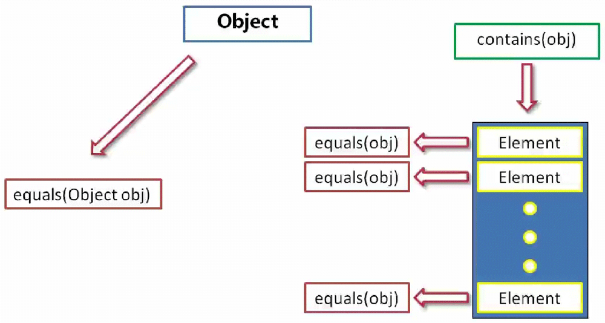
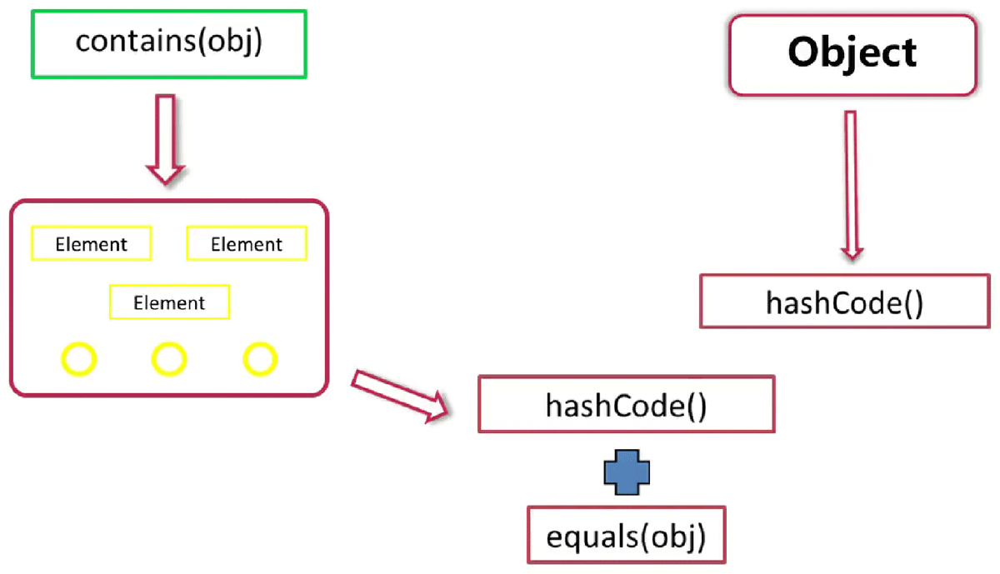
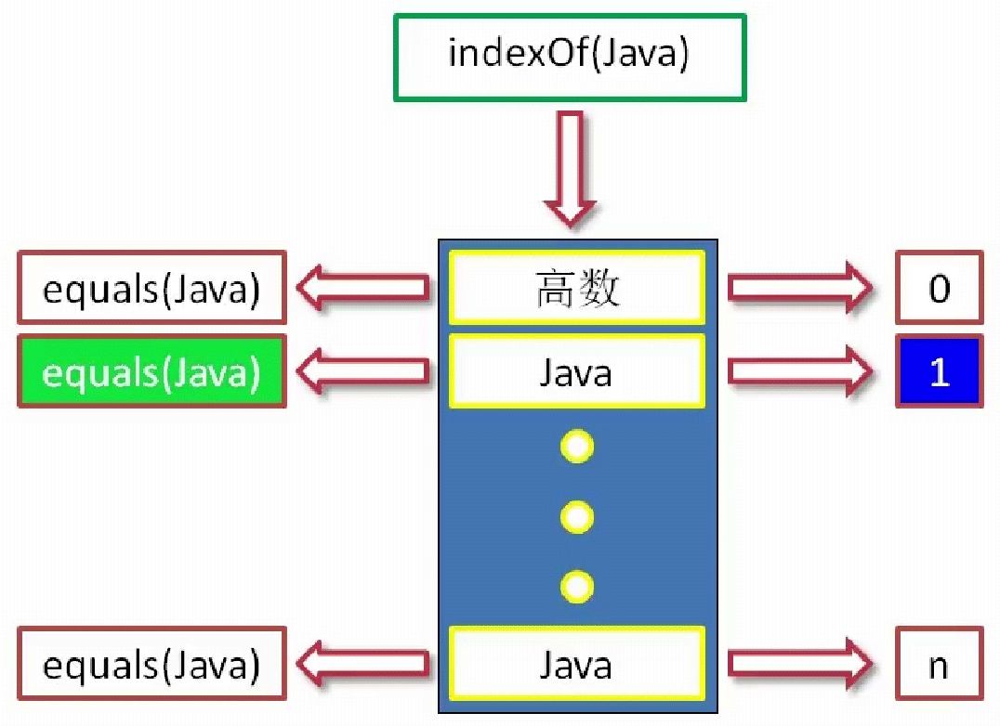

# 问题思考

> [!NOTE|label:问题思考]

> 在课程序列中，如何判断是否包含某门或者某几门课程？

> 如果课程序列包含某门课程，如果判断该课程的索引位置？

> 在学生映射表中，如何判断是否包含某个学ID？

> 又该如何判断是否包含某个学生对象？

> 如何按照课程名称或者学生姓名排序？或是按ID排序？

TestSet.java

```java
public void testLsitContains() {
	// 获取备选课程的第0个元素
	Course course = coursesToSelect.get(0);
	// 打印输出coursesToSelect是否包含course对象
	System.out.println("取得课程：" + course.name);
	System.out.println("备选课程中是否包含课程：" + course.name + ", " + coursesToSelect.contains(course));
	// 创建一个新的课程对象，ID和名称，与course对象完全一样
	Course courseB = new Course(course.id, course.name);
	System.out.println("取得课程：" + courseB.name);
	System.out.println("备选课程中是否包含课程B：" + courseB.name + ", " + coursesToSelect.contains(courseB));
}
```

> [!NOTE|style:flat|label:List contains()]

> 在课程序列中，如何判断是否包含某门或者某几门课程？


运行结果：

```
取得课程：数据结构
备选课程中是否包含课程：数据结构, true
取得课程：数据结构
备选课程中是否包含课程B：数据结构, false
```



重写Course类的equals方法

```java
@Override
public boolean equals(Object obj) {
	if (this == obj)
		return true;
	if (obj == null)
		return false;
	if (!(obj instanceof Course))
		return false;
	Course course = (Course) obj;
	if (this.name == null) {
		return course.name == null;
	} else {
		return this.name.equals(course.name);
	}
}
```

再次运行TestSet类，输出结果：

```
取得课程：数据结构
备选课程中是否包含课程：数据结构, true
取得课程：数据结构
备选课程中是否包含课程B：数据结构, true
```



> [!NOTE|style:flat|label:List indexOf()]

> 如果课程序列包含某门课程，如果判断该课程的索引位置？

> indexOf: 列表头开始遍历，获取元素第一次出现位置的索引。

> lastIndexOf：从列表尾部（队尾）开始遍历，获取元素最后一次出现的位置索引。



```java

```

> [!NOTE|style:flat|label:Map containsKey(), containseValue()]

> 在Map中，用containsKey()方法，判断是否包含某个key值

> 使用containsValue()方法，判断是否包含某个Value值

```java
/**
 * 测试containsKey and containsValue方法
 */
public void testContainsKeyOrValue() {
    // 提示输入学生ID
    System.out.println("请输入要查询的学生ID：");
    Scanner console = new Scanner(System.in);
    String id = console.next();
    // 在Map中，用containsKey()方法，判断是否包含某个key值
    System.out.println("您输入的学生ID为：" + id + ", 在学生映射表中是否存在：" +
        students.containsKey(id));
    if (students.containsKey(id)) {
        System.out.println("对应的学生是：" + students.get(id).name);
    }
    // 提示用户按姓名查询
    System.out.println("请输入要查询的学生姓名：");
    String name = console.next();
    // 使用containsValue()方法，判断是否包含某个Value值
    if (students.containsValue(new Student(0, name))) {
        System.out.println("学生映射表中包含学生：" + name);
    } else {
        System.out.println("学生" + name + "不存在!");
    }
}
```

重写学生类的equals，hash方法。IDE自动生成：

```
鼠标右键代码区（或IDE菜单栏）Source -> Generate hashCode() and equals()...
勾选Use 'instanceof' to compare types项
```

```java
@Override
public int hashCode() {
    final int prime = 31;
    int result = 1;
    result = prime * result + ((name == null) ? 0 : name.hashCode());
    return result;
}

@Override
public boolean equals(Object obj) {
    if (this == obj)
        return true;
    if (obj == null)
        return false;
    if (!(obj instanceof Student))
        return false;
    Student other = (Student) obj;
    if (name == null) {
        if (other.name != null)
            return false;
    } else if (!name.equals(other.name))
        return false;
    return true;
}
```

### 代码

https://github.com/capricorncd/Java-Notes/tree/master/codes/collection-and-map/src/com/test/collection
