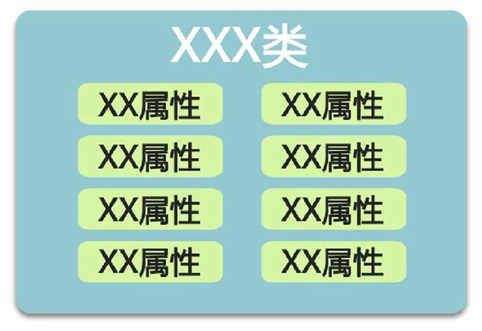
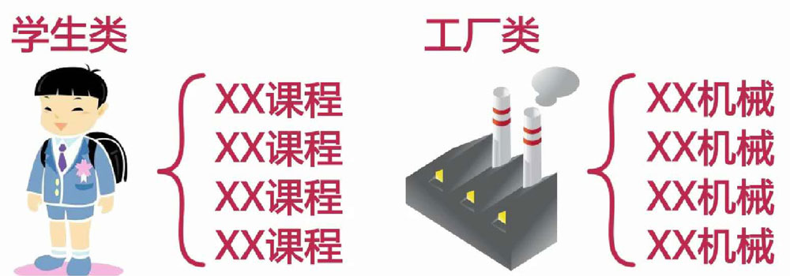
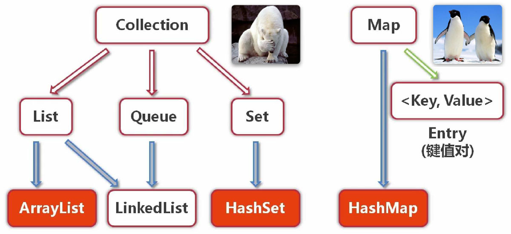

# Java中的集合框架

### 集合的概念

**现实生活中**：把很多的事物凑在一起。比如购物车是商品的集合，军队是军人的集合等。

**数学中的集合**：具有共同属性的事物的总体。比如有理数，整数等。

**Java中的集合类**：是一种工具类，就像是容器，储存任意数量的具有共同属性的对象。

##### 集合的作用

在类的内部，对数据进行组织；

简单而快捷的搜索大数量的条目；

有的集合接口，提供了一系列排列有序的元素，并且可以在序列中间快速的插入或者删除有关元素。

有的集合接口，提供了映射关系，可以通过关键字key去快速查找到对应的唯一对象，而这个关键字可以是任意类型。

##### 与数组对比

数组长度固定，超出长度时，需要重新创建拷贝数据到新的数据。

集合：长度可以根据数据数量自动改变。

> [!TIP|style:flat|label:总结]

> 数组的长度固定，集合长度可变。

> 数组只能通过下标访问元素，类型固定，查找数据需要逐个遍历。而有的集合可以通过任意类型查找所映射的具体对象。

### Java集合框架体系结构

主要由两大家族（两个根接口）组成：Collection、Map

1、Collection子接口：List、Queue、Set

List（序列）、Queue（队列）：元素排列有序，且可以重复。

Set（集）：元素无序，且不可重复。

List与Set较为常用。

List中一个很重要的实现类ArrayList（数组序列）。

Queue中一个重要的实现类LinkedList（链表），同时也是List的实现类。

Set中一个重要的实现类HashSet（哈希集）。

2、Map

Map也有很多子接口。

Map中一个很重要的实现类：HashMap（哈希表）。

> [!TIP|style:flat|label:数据存储]

> Collection中存储一个个独立的对象。

> Map内以Key、Value键值对形式存储数据，即一个Entry（键值对，Map的内部类）类的实例。Key、Value可以是任意类型的对象。

> Collection可以想象为单身宿舍，里面存储的一个一个的光棍。

> Map内存储的一对一对的夫妇。

### Collection接口、子接口以及实现类

Collection接口

是List、Set和Queue接口的父接口。

定义了可用于操作List、Set、Queue的方法：增删改查。

#### List接口及其实现类：ArrayList

List是元素有序，并且可以重复的集合，被称为序列。

List可以精确的控制每个元素的插入位置，或删除某个指定位置元素。

ArrayList：数组序列，是List的一个重要实现类。

ArrayList底层是由数组实现的。

> [!NOTE|label:练习-模拟学生选课功能]

> 选择课程（往集合中添加课程）

> 删除所选的某门课程（删除集合中的元素）

> 查看所选课程

> 修改所选课程

