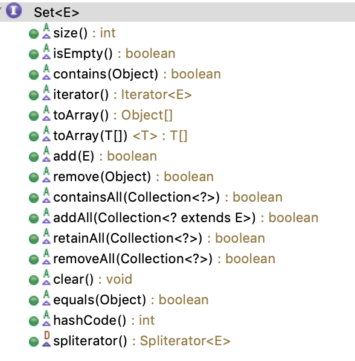
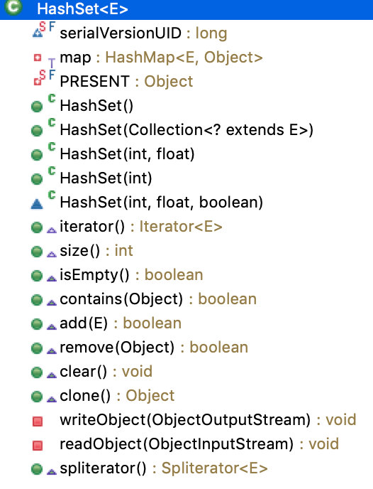

# Set(集)接口，及其实现类 —— HashSet

Set是元素无序，并且不可以重复的集合，被称为**集**。



HashSet：哈希集，是Set的一个重要实现类。



> [!NOTE|label:案例功能说明]

> 提供备选课程

> 创建学生对象，并给该学生添加三门课程（添加在学生的courses——Set类型的属性中）

> * 显示备选课程

> * 循环三次，每次输入课程ID

> * 往学生的Courses属性中添加与输入的ID匹配的课程

> * 输出学生选课的课程

Student类

```java
import java.util.HashSet;
import java.util.Set;

/**
 * 学生类
 * @author capricorncd
 *
 */
public class Student {
	public int id;
	public String name;
	public Set<Course> courses;

	public Student (int id, String name) {
		this.id = id;
		this.name = name;
		//  初始化
		this.courses = new HashSet<Course>();
	}
}

```

TestSet类

```java
import java.util.ArrayList;
import java.util.Arrays;
import java.util.List;
import java.util.Scanner;

public class TestSet {

	public List<Course> coursesToSelect;

	// constructor
	public TestSet() {
		coursesToSelect = new ArrayList<Course>();
	}

	/**
	 * System.out.println
	 * @param str
	 */
	public static void print(String str) {
		System.out.println(str);
	}

	/**
	 * 通过for each方法访问集合元素
	 */
	public void testForEach() {
		print("-------------- testForEach ---------------");
		print("有以下课程待选(通过forEach访问)：");
		for (Object obj : coursesToSelect) {
			Course cr = (Course) obj;
			print("Course: " + cr.id + " " + cr.name);
		}
		print("-------------- 华丽的分割线 ---------------");
	}

	/**
	 * 添加备课程
	 */
	public void testAdd() {
		coursesToSelect.add(new Course(1, "数据结构"));
		coursesToSelect.add(new Course(2, "C语言"));
		// 批量添加课程
		Course[] courses = { new Course(3, "离散数学"), new Course(4, "汇编语言"), new Course(5, "高等数学"), new Course(6, "GoLang") };
		coursesToSelect.addAll(Arrays.asList(courses));
	}

	/**
	 * 遍历输出学生的课程
	 * @param student
	 */
	public void forEachForSet(Student student) {
		print(student.name + "成功选择了" + student.courses.size() + "门课程！");
		for (Course cr : student.courses) {
			print(cr.id + ":" + cr.name);
		}
	}

	public static void main(String[] args) {
		TestSet ts = new TestSet();
		ts.testAdd();
		ts.testForEach();
		// 创建一个学生对象
		Student student = new Student(1, "John");
		print("欢迎学生：" + student.name + "选课！");
		// 创建一个Scanner对象，用来接收从键盘输入的课程ID
		Scanner input = new Scanner(System.in);
		// 循环三次，每次输入课程ID
		for (int i = 0; i < 3; i++) {
			System.out.print("请输入课程ID: ");
			Integer courseID = new Integer(input.next());
			for (Course cr : ts.coursesToSelect) {
//				if (cr.id.equals(courseID)) { // 字符串比较
				if (cr.id == courseID) {
					// 往学生的Courses属性中添加与输入的ID匹配的课程
					student.courses.add(cr);
				}
			}
		}
		// 输出学生选课的课程
		ts.forEachForSet(student);
	}

}
```

> [!WARNING|style:flat|label:注意]

> Set 只能使用 foreach或iterator遍历，不能像List那样使用get()方法。

> 因为Set是无序的，不能通过索引去查找元素，只能通过foreach或iterator一个个循环迭代出来。而且每次迭代出来的结果顺序都可能不同。

> Set中可以添加 `null` 空对象，不过在实际应用中不常见。

### 代码

https://github.com/capricorncd/Java-Notes/tree/master/codes/collection-and-map/src/com/test/collection
