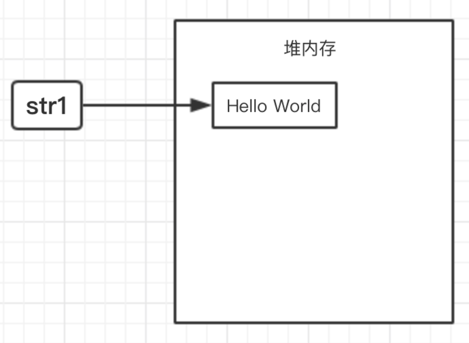
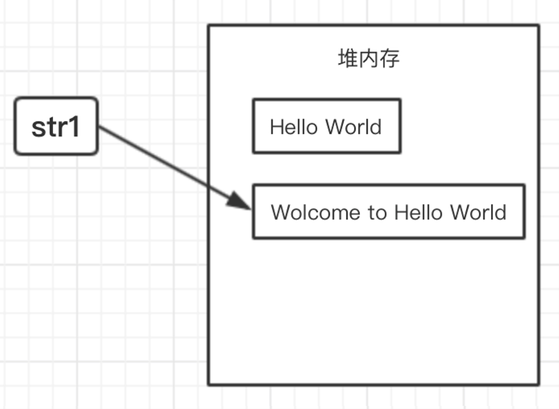
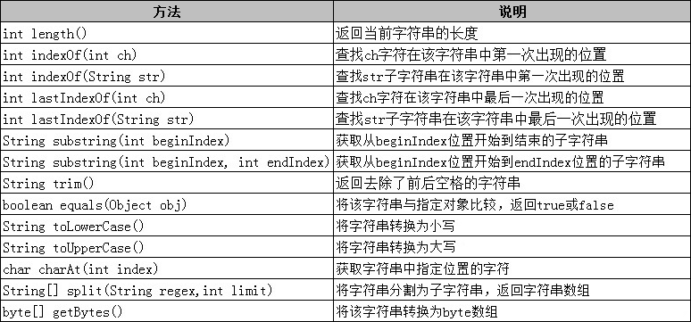

# 字符串

在 Java 中，字符串被作为 String 类型的对象处理。 String 类位于 java.lang 包中。默认情况下，该包被自动导入`所有的程序`。

### 创建String对象的方法

创建一个字符串对象"Hello World"，变量名为str

```java
String str = "Hello World";
```

创建一个空字符串对象

```java
String str = new String();
```

创建一个字符串对象

```java
String str = new String("Hello World");
```

### 字符串的不变性

String 对象创建后则 `不能被修改`，是`不可变的`。所谓的修改其实是创建了新的对象，所指向的内存空间不同。

```java
String str1 = "Hello World";
String str2 = "Hello World";
String Str3 = new String("Hello World");
String Str4 = new String("Hello World");

// 多次出现的字符串常量，Java编译程序只创建一个，所以返回true
System.out.println(str1 == str2);

// str1和str3是不同的对象，所以返回false
System.out.println(str1 == str3);

// str3和str4是不同的对象，所以返回false
System.out.println(str3 == str4);

str1 = "Wolcome to " + str1;
// 字符串str1被修改，指向新的内存空间
System.out.println(str1);
```

> [!TIP|style:flat|label:总结]

> 在第一次使用字符串引用的使用，也是通过new来创建字符串的，只是隐式的new一个字符串对象

> 在你第二次使用同一个字符串的时候，会查找堆内存中有没有和该字符串一样的，如果有就直接引用这个堆中已经有的字符串对象，如果没有，还是会new一个；

> 而直接使用new的方法，创建字符串，是不管堆中有没有，直接创建一个新的对象，所以在比较的时候，都是false

##### 关系图说明：

1、通过 String str1 = "Hello World"; 声明了一个字符串对象， str1 存放了到字符串对象的引用。



然后通过 str1 = "Wolcome to " + str1; 改变了字符串 str1 ，其实质是创建了新的字符串对象，变量 str1 指向了新创建的字符串对象。



2、一旦一个字符串在内存中创建，则这个字符串将不可改变。如果需要一个可以改变的字符串，我们可以使用StringBuffer或者StringBuilder。

3、每次 new 一个字符串就是产生一个新的对象，即便两个字符串的内容相同，使用 `==` 比较时也为 `false` ,如果只需比较内容是否相同，应使用 `equals()` 方法。

### String 类的常用方法



```java
package com.string;
import java.util.Arrays;

public class StrTest {

	public static void main(String[] args) {
		String str = "Hello World";
		System.out.println("length(): " + str.length());
		// find char W
		char w = 'W';
		System.out.println("indexOf('W'): " + str.indexOf(w));
		// split array
		String[] arr = str.split(" ");
		System.out.print("Arrays.toString(): " + Arrays.toString(arr));
		System.out.println();
		// get children string by index[3, 7)
		System.out.println("get children string by index[3, 7) , with substring(): " + str.substring(3, 7));
	}

}
```

运行结果：

```
length(): 11
indexOf(w): 6
Arrays.toString(): [Hello, World]
get children string by index[3, 7) , width substring(): lo W
```

> [!TIP|style:flat|label:总结]

> 1、字符串 str 中字符的索引从0开始，范围为 0 到 str.length()-1

> 2、使用 indexOf 进行字符或字符串查找时，如果匹配返回位置索引；如果没有匹配结果，返回 -1

> 3、使用 substring(beginIndex , endIndex) 进行字符串截取时，包括 beginIndex 位置的字符，不包括 endIndex 位置的字符
