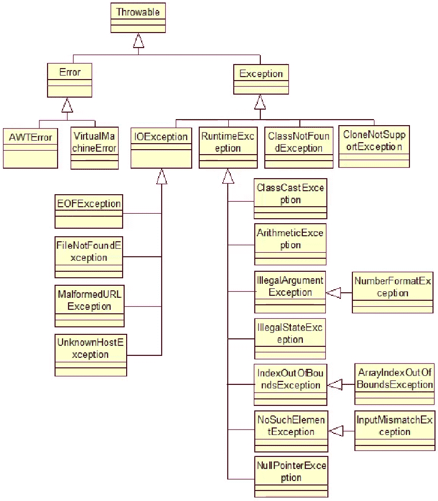

# 异常抛出及自定义异常

### Java中的异常抛出

throw 将产生的异常抛出（动作）

throws 声明将要抛出何种类型的异常（声明）

```java
public void 方法名(参数列表) throws 异常列表 {
    // 调用会抛出异常的方法或者：
    throw new Exception();
}
```

例子：声明抛出一个异常

```java
public void divide(int one, int two) trhows Exception {
    if (two == 0) {
        throw new Exception("两数相除，除数不能为0");
    } else {
        System.out.println("两数相除，结果为：" + one / two);
    }
}
```

处理1：使用try-catch处理

```java
public void compute () {
    // do something
    try {
        divide(5, 0);
    } catch (Exception e) {
        System.out.println(e.getMessage());
    }
}
```

处理2：(或)继续抛出异常，让其他更上一层调用程序去处理

```java
public void compute() throws Exception {
    // do something
    divide(5, 0);
}
```



### 自定义异常

```java
class 自定义异常类 extends 异常类型 {
    // do something
}
```
例子

```java
package com.test

public class DrunkException extends Exception {
    // 自定义一个有参的构造器
    public DrunkException(String message) {
        super(message);
    }
    // 因为自定义了构造器，所以编译器不会为我们自动创建一个无参构造器
    // 但，有时候我们需要用到无参的构造器，所以再添加一个无参构造器
    public DrunkException() {
        // ...
    }
}
```

### Java中的异常链

异常链功能实现，两种实现方法：

```java
package com.test

public class ChainTest {
    /**
     * test1()：抛出"喝大了"异常
     * test2()：调用test1()，捕获"喝大了"异常，并且包装成运行时异常，继承抛出
     * main方法中，调用test2()，尝试捕获test2()方法抛出的异常
     */
     public static void main(String[] args) {
        ChainTest ct = new ChainTest();
        try {
            ct.test2();
        } catch (Exception e) {
            e.printStack();

        }
     }

     public void test1 () throws DrunkException {
        throw new DrunkException("喝酒别开车！");
     }

     public void test2 () {
        try {
            test1();
        } catch (DrunkException e) {
            // 包装成运行时异常
            RuntimeException newExc = new RuntimeException("司机一滴酒，亲人两行泪");
            newExc.initCause(e);
            throw newExc;
        }
     }
}
```

或者

```java
public void test2 () {
    try {
        test1();
    } catch (DrunkException e) {
        // 包装成运行时异常
        RuntimeException newExc = new RuntimeException(e);
        throw newExc;
    }
}
```

> [!TIP|style:flat|label:总结]

> Exception的父类是Throwable

> 使用try-catch-finally语句捕获并处理异常

> 可以使用throw语句抛出异常

### 实际应用中的经验与总结

1、处理运行时异常时，采用逻辑去和里规避同时辅助try-catch处理

2、在多重catch块后面，可以加一个catch（Exception）来处理可能会被遗漏的异常

3、对于不确定的代码，也可以加上try-catch，处理潜在的异常

4、尽量去处理异常，切忌只是简单的调用printStackTrace()去打印输出

5、具体如何处理异常，要根据不同的业务需求和异常类型去决定

6、尽量添加finally语句块去释放占用的资源，尤其是在有网络连接或有数据库操作的情况下等等。

### 练习题

要求：

1、定义字符串数组保存图书信息

2、提示用户输入，分别按"书名"和"图书序号"查找图书

3、根据输入信息进行适当的异常处理

    a、如果输入类型错误，抛出"错误命令异常"，并提示重新输入

    b、如果书名不存在，抛出"图书不存在异常"，并提示重新输入

    c、如果图书序号超过字符串数组范围，抛出"图书不存在异常"，并提示重新输入
